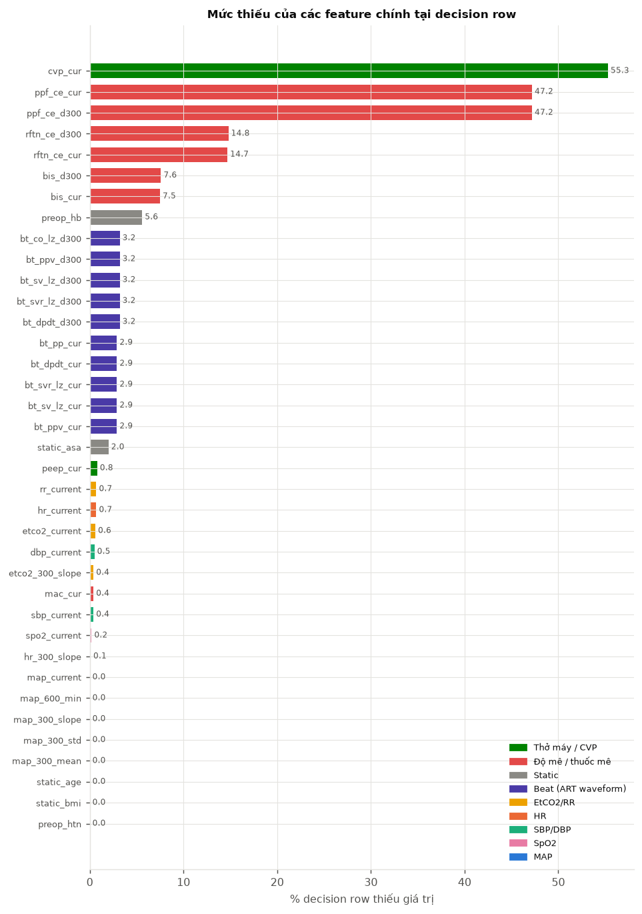
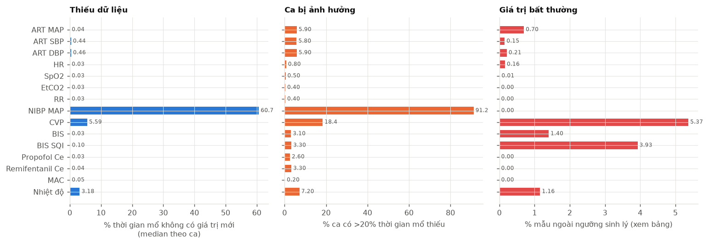
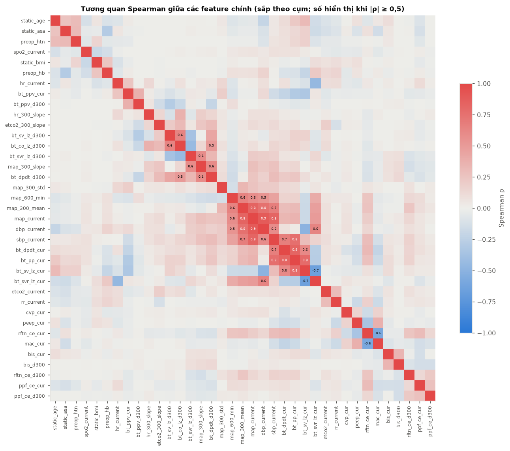
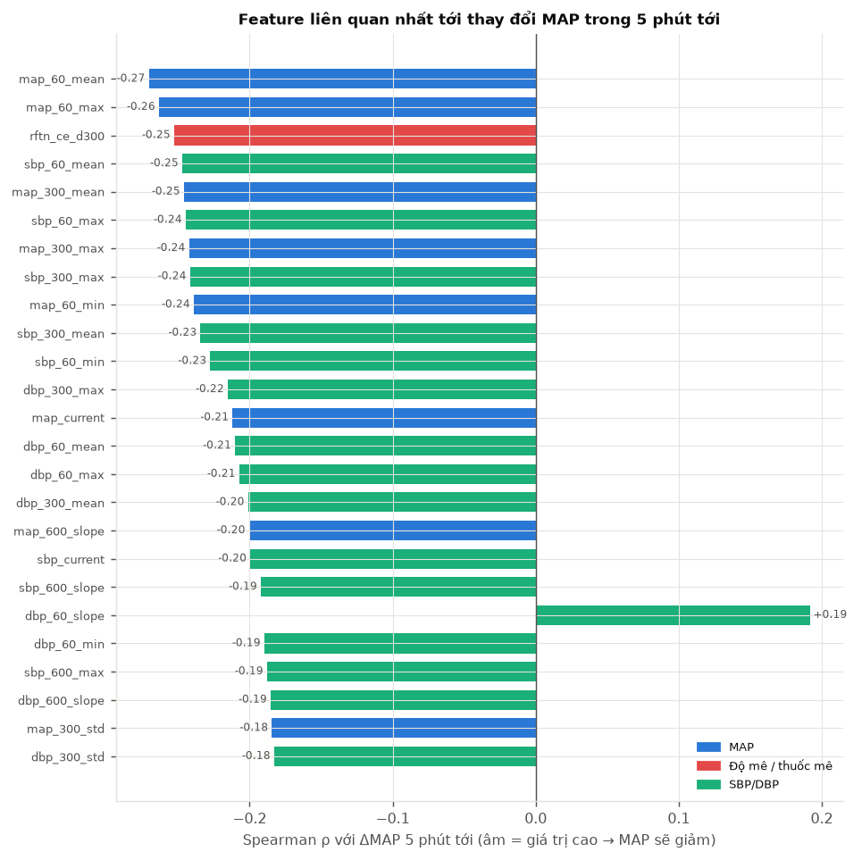
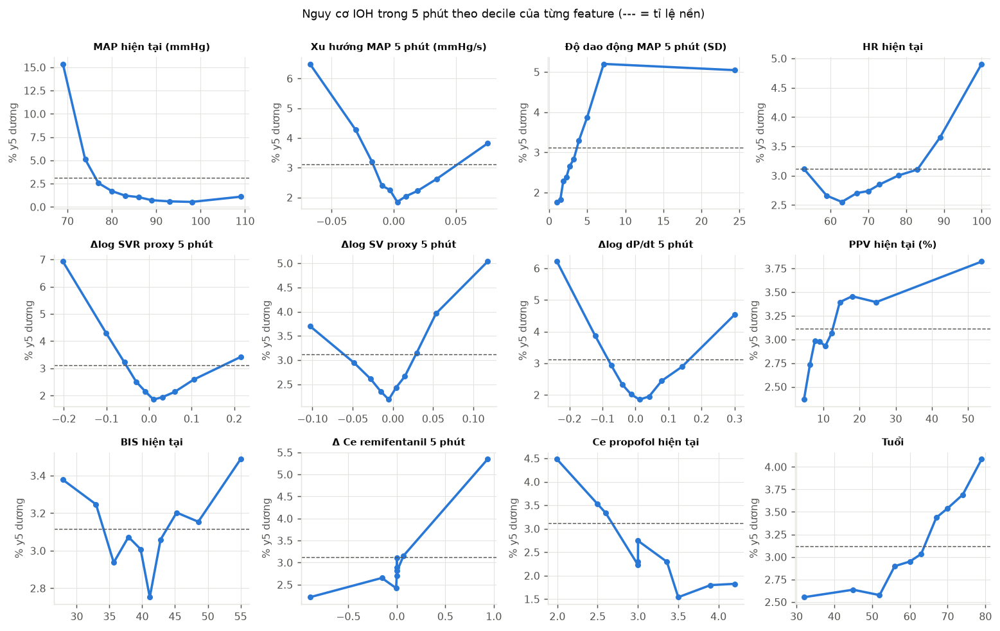
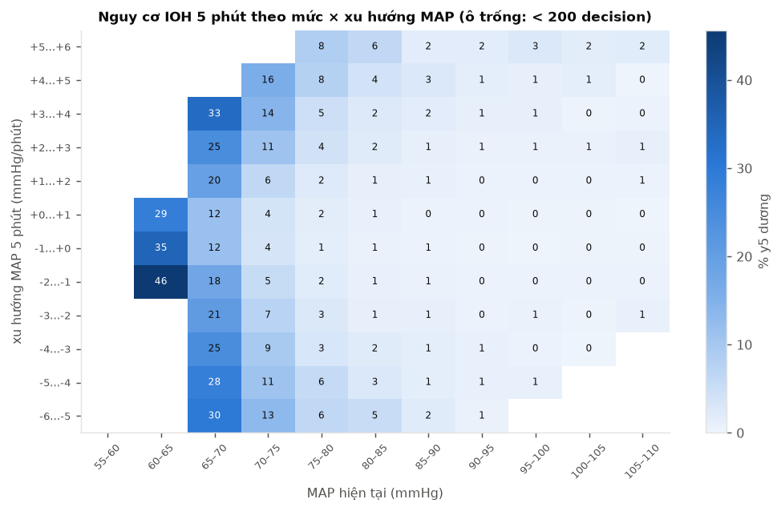
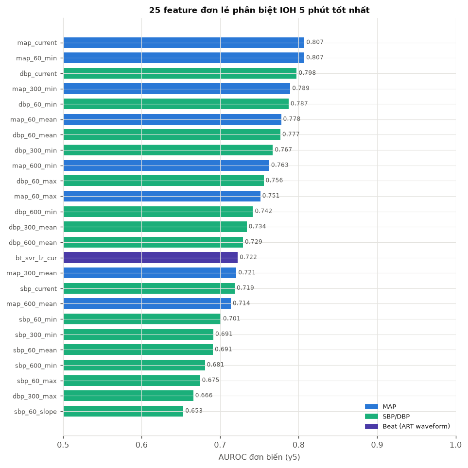
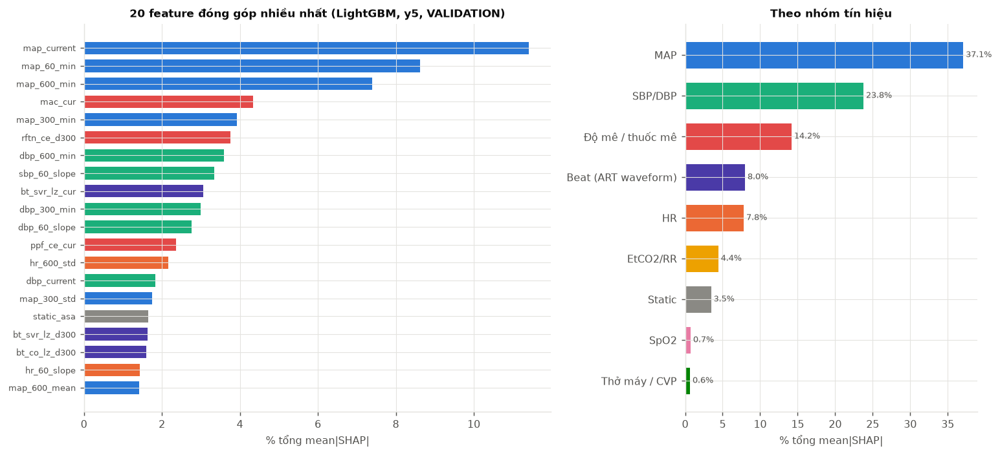
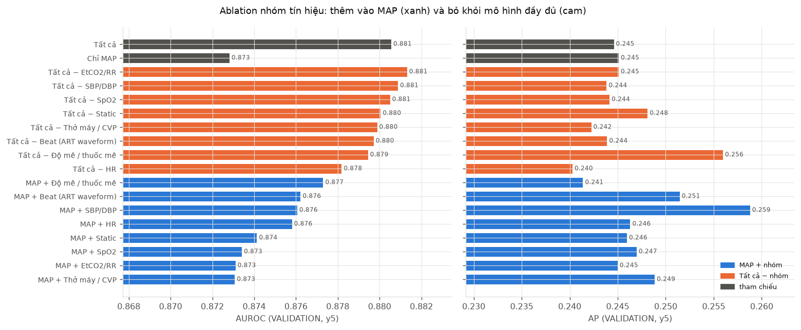

# VitalDB cho UC04 — Insight về dữ liệu

Sinh tự động bởi `scripts/eda/run_insights.py` (module `safeanes.insights`). Bổ sung cho [REPORT.md](REPORT.md) (EDA tổng quát).
Phạm vi: nhiễu đo trên **mọi ca eligible** (không chạm outcome); mọi phân tích có nhãn chỉ dùng **ca phát triển ngoài global test**.
Mô hình dùng để đo tầm quan trọng (LightGBM, tham số E08) train trên FIT và báo cáo trên VALIDATION — chỉ mang tính mô tả,
không dùng để chọn mô hình.

## Insight chính

Phạm vi: 2.961 ca phát triển có ít nhất một thời điểm dự báo hợp lệ (149 ca còn lại không có, chủ yếu vì lịch sử MAP không đủ);
407.490 thời điểm (mỗi 60 s); 173 feature. Nhiễu đo trên 3.626 ca eligible.

### 1. Dữ liệu là gì — nói ngắn gọn

- Mỗi thời điểm dự báo có **173 feature**, chia thành 9 nhóm:
  - 7 tín hiệu monitor: MAP, SBP, DBP, HR, SpO2, EtCO2, RR; mỗi tín hiệu có thống kê 1/5/10 phút;
  - 14 feature theo nhịp từ **waveform ART**;
  - độ mê và thuốc mê: BIS, MAC, Ce propofol/remifentanil;
  - thở máy và CVP;
  - thông tin trước mổ.
- Nhãn rất **mất cân bằng**: chỉ khoảng **3,1%** thời điểm có IOH trong 5 phút tới (6,2% với 10 phút). Accuracy vì vậy vô nghĩa; phải dùng AUROC/AP, PPV và cảnh báo giả/giờ.
- **Thiếu dữ liệu theo cấu trúc, không ngẫu nhiên:**
  - Tín hiệu lõi gần như đầy đủ.
  - Beat features thiếu 2,9% (ca có kênh ART hỏng).
  - BIS thiếu 7,5%; Ce remifentanil thiếu 14,7%.
  - Ce propofol chỉ có khi gây mê TIVA (thiếu 47%).
  - CVP chỉ có khi đặt catheter trung tâm (thiếu 55%).
  - Việc thiếu tự nó mang thông tin (loại gây mê, loại mổ), nên mô hình cần mask thay vì điền giá trị.

### 2. Nhiễu — dữ liệu sạch hơn dự kiến, nhưng nhiễu nằm đúng chỗ nguy hiểm

- **Tín hiệu lõi rất sạch.** MAP, HR, SpO2, EtCO2 thiếu dưới 0,5% thời gian mổ (median theo ca). Nhưng **5,9% ca** mất hơn 20% thời gian ART.
- **Nhiễu tập trung ở huyết áp động mạch, chính là tín hiệu tạo nhãn:**
  - 0,70% mẫu MAP nằm ngoài 20–200 mmHg;
  - trung bình 5,8 lần MAP nhảy trên 30 mmHg mỗi giờ (flush, lấy máu, zeroing);
  - **4,9% biến cố IOH có MAP thấp nhất ≤ 30 mmHg**, nhiều khả năng là artefact được tính thành biến cố.
- **Waveform ART:** median 97,6% nhịp hợp lệ, nhưng 180 ca có dưới 50% nhịp hợp lệ. Nhiều ca có kênh ART ghi nhiễu quanh 0 trong khi monitor vẫn báo MAP.
- **Tín hiệu phụ nhiễu hơn:**
  - CVP: 5,4% mẫu ngoài −5–40 mmHg;
  - BIS: 3,9% mẫu có SQI < 50;
  - HR đứng yên ≥ 60 s ở khoảng 6% thời gian (monitor giữ giá trị).
- **NIBP không dùng được như tín hiệu liên tục.** Ở 91% ca, NIBP thiếu hơn 20% thời gian mổ, vì máy thường ngừng đo khi đã có ART.

### 3. Quan hệ giữa các feature

- **Dư thừa lớn trong nhóm huyết áp.** MAP–DBP ρ = 0,89, MAP–SBP 0,82. SVR proxy đi cùng DBP (0,63). PP, dP/dt và SBP gần như cùng một trục (0,7–0,8). Mô hình chỉ cần một đại diện cho mỗi trục.
- **Khi MAP đang giảm, SVR proxy và dP/dt giảm theo** (ρ ≈ 0,6 giữa độ dốc MAP 5 phút và Δlog SVR / Δlog dP/dt). SV proxy thì không giảm cùng. Đây là dấu hiệu nhất quán với **giãn mạch là cơ chế chính** (khớp EDA chính).
- **SV proxy và SVR proxy ngược chiều** (ρ = −0,70): cùng một MAP có thể là "SV cao + SVR thấp" (giãn mạch) hoặc "SV thấp + SVR cao" (thiếu dịch). Phân rã SV × HR × SVR nhằm tách đúng hai trạng thái này.
- **Thay đổi MAP trong 5 phút tới:**
  - Giá trị MAP/SBP cao hiện tại liên quan với giảm sau đó (ρ ≈ −0,25), một phần là hồi quy về trung bình.
  - Ngoài huyết áp, feature liên quan mạnh nhất là **Ce remifentanil tăng trong 5 phút qua (ρ = −0,25)**.
  - Kế tiếp là PP và dP/dt hiện tại (−0,16 / −0,14), EtCO2 giảm dần (−0,13) và MAC tăng (−0,11).
- **Mức × xu hướng MAP** (ma trận nguy cơ):
  - MAP 65–70 có nguy cơ 12–33% bất kể xu hướng; MAP 60–65 mà chưa thành biến cố có 29–46%.
  - MAP 75–80 đang giảm 5–6 mmHg/phút có 6%, so với 1–2% khi ổn định.
  - Trên 90 mmHg, nguy cơ gần 0 dù đang giảm.
  - Xu hướng chỉ có giá trị ở vùng giữa, đúng với lập luận của mô hình ngoại suy MAP (LepMAP).
- **Đường nguy cơ có dạng chữ U** với Δ SVR, Δ SV và Δ dP/dt: cả giảm mạnh lẫn tăng mạnh đều tăng nguy cơ. Tăng mạnh thường là giai đoạn hồi phục sau một biến cố hoặc sau thuốc vận mạch, tức là "huyết động không ổn định". Dạng quan hệ này là phi tuyến, nên cần mô hình cây hoặc deep learning, không dùng hồi quy tuyến tính.

### 4. Feature ảnh hưởng nhất

- **MAP hiện tại và MAP thấp nhất gần đây là số 1, ở mọi cách đo:**
  - AUROC đơn biến 0,807 (y5);
  - khoảng 37% tổng SHAP (thêm 24% từ SBP/DBP);
  - riêng 20 feature MAP đạt AUROC 0,873 trên VALIDATION.
  - Điều này khớp với y văn: HPI tương quan mạnh với MAP (Frassanito 2024) và không hơn ngưỡng MAP (Mulder 2024).
- **Thêm mọi tín hiệu khác chỉ cải thiện rất ít:**
  - 173 feature đạt AUROC 0,881 so với 0,873 của riêng MAP; ΔAUROC +0,008 (95% CI +0,001 đến +0,015, 251 ca).
  - AP không khác (+0,001, CI −0,022 đến +0,029).
  - → **Giới hạn hiệu năng của UC04 không nằm ở số lượng tín hiệu.** Nó nằm ở chất lượng nhãn (artefact), mất cân bằng và chính sách cảnh báo.
- **Nhóm có giá trị cộng thêm lớn nhất là độ mê / thuốc mê:**
  - 14% SHAP ở y5, 19% ở y10, tăng theo horizon;
  - MAC hiện tại (cao → nguy cơ);
  - **Ce remifentanil tăng trong 5 phút** (tăng > 1 ng/mL: nguy cơ y5 7,6% so với 2,9% khi ổn định);
  - Ce propofol (thấp → nguy cơ, nhưng bị nhiễu bởi loại gây mê: ca khí mê có y5 3,8% so với 2,6% ở ca TIVA).
  - Đây là bằng chứng dữ liệu cho nhánh "giãn mạch do thuốc mê" của UC04, dù chưa phải quan hệ nhân quả.
- **Beat features từ waveform ART:**
  - 8% SHAP; SVR proxy hiện tại là feature đơn lẻ tốt nhất ngoài huyết áp (AUROC 0,72, SVR thấp → nguy cơ).
  - Giá trị chính của chúng **không nằm ở tăng AUROC** (+0,003). Nó nằm ở chỗ chúng là tín hiệu duy nhất cho phép giải thích cơ chế: SV, SVR, dP/dt, PPV.
- **HR** (độ dao động 10 phút, HR cao → nguy cơ) và **ASA** có đóng góp nhỏ.
- **SpO2, thở máy và CVP** gần như không đóng góp cho dự báo.
- **Ý nghĩa cho thiết kế:**
  - Nhánh dự báo nên giữ MAP làm lõi và ưu tiên sửa nhãn và chính sách cảnh báo.
  - Beat features và thuốc mê là đầu vào cho nhánh giải thích nguyên nhân.
  - Mọi cải thiện phải được so với baseline chỉ MAP bằng CI theo ca.

---

## 1. Dữ liệu gồm những gì

Mỗi **decision row** là một thời điểm dự báo (30 s một lần; ở đây lấy 1/2 → 60 s) chỉ dùng dữ liệu quá khứ.

| index | giá trị |
|---|---|
| decision row (lấy mẫu 1/2, mỗi 60 s) | 407,490 |
| ca | 2,961 |
| bệnh nhân | 2,853 |
| feature | 173 |
| row có nhãn y5 | 381,904 |
| tỉ lệ y5 dương (%) | 3.12 |
| tỉ lệ y10 dương (%) | 6.19 |

Các nhóm feature (bảng đầy đủ: `insight_dictionary.csv`):

| nhóm | số feature | % thiếu median | % thiếu max |
|---|---|---|---|
| EtCO2/RR | 40 | 0.5 | 0.7 |
| SBP/DBP | 40 | 0 | 0.5 |
| SpO2 | 20 | 0 | 0.2 |
| HR | 20 | 0.1 | 0.7 |
| MAP | 20 | 0 | 0 |
| Beat (ART waveform) | 14 | 2.9 | 3.2 |
| Độ mê / thuốc mê | 8 | 11.15 | 47.2 |
| Static | 7 | 0 | 5.6 |
| Thở máy / CVP | 4 | 28.1 | 55.4 |

Cách đọc tên feature:
- `map_300_slope`: độ dốc MAP trong 300 s gần nhất.
- `*_60/300/600_*`: thống kê trong 1/5/10 phút gần nhất (`missing` = tỉ lệ thiếu, `mean`, `std`, `min`, `max`, `slope`).
- `*_current`: giá trị mới nhất; `*_age`: số giây từ lần đo cuối.
- `bt_*`: đặc trưng theo nhịp từ waveform ART.
- `*_cur`: median 60 s gần nhất; `*_d300`: thay đổi so với 5 phút trước (log-ratio với tín hiệu dương).
- `static_*`, `sex`, `emop`, `preop_*`: thông tin trước mổ.

Feature chính (phân vị theo decision row):

| feature | nhóm | % thiếu | p1 | p25 | median | p75 | p99 |
|---|---|---|---|---|---|---|---|
| map_current | MAP | 0 | 66 | 77 | 84 | 93 | 131 |
| map_300_mean | MAP | 0 | 66.85 | 77.29 | 84.61 | 93.45 | 121.17 |
| map_300_slope | MAP | 0 | -0.19 | -0.02 | 0 | 0.02 | 0.19 |
| map_300_std | MAP | 0 | 0.71 | 1.87 | 2.96 | 5.03 | 55.58 |
| map_600_min | MAP | 0 | 22 | 66 | 73 | 81 | 102 |
| sbp_current | SBP/DBP | 0.4 | 89 | 108 | 119 | 131 | 170 |
| dbp_current | SBP/DBP | 0.5 | 47 | 58 | 64 | 71 | 94 |
| hr_current | HR | 0.7 | 48 | 63 | 71 | 82 | 116 |
| hr_300_slope | HR | 0.1 | -0.07 | -0.01 | -0 | 0.01 | 0.08 |
| spo2_current | SpO2 | 0.2 | 95 | 100 | 100 | 100 | 100 |
| etco2_current | EtCO2/RR | 0.6 | 27 | 33 | 35 | 37 | 45 |
| etco2_300_slope | EtCO2/RR | 0.4 | -0.02 | -0 | 0 | 0 | 0.02 |
| rr_current | EtCO2/RR | 0.7 | 9 | 12 | 14 | 16 | 20 |
| bt_sv_lz_cur | Beat (ART waveform) | 2.9 | 0.17 | 0.26 | 0.3 | 0.34 | 0.46 |
| bt_sv_lz_d300 | Beat (ART waveform) | 3.2 | -0.25 | -0.03 | -0 | 0.03 | 0.28 |
| bt_svr_lz_cur | Beat (ART waveform) | 2.9 | 1.8 | 3.2 | 3.96 | 4.94 | 8.36 |
| bt_svr_lz_d300 | Beat (ART waveform) | 3.2 | -0.45 | -0.06 | 0 | 0.06 | 0.47 |
| bt_co_lz_d300 | Beat (ART waveform) | 3.2 | -0.37 | -0.04 | -0 | 0.04 | 0.43 |
| bt_ppv_cur | Beat (ART waveform) | 2.9 | 3.33 | 7.7 | 11.43 | 18.24 | 115.44 |
| bt_ppv_d300 | Beat (ART waveform) | 3.2 | -83.64 | -3.18 | -0.01 | 2.81 | 81.55 |
| bt_dpdt_cur | Beat (ART waveform) | 2.9 | 312.05 | 623.26 | 775.42 | 954.59 | 1,624.63 |
| bt_dpdt_d300 | Beat (ART waveform) | 3.2 | -0.47 | -0.07 | 0 | 0.08 | 0.63 |
| bt_pp_cur | Beat (ART waveform) | 2.9 | 28.75 | 46.59 | 54.24 | 62.99 | 93.33 |
| bis_cur | Độ mê / thuốc mê | 7.5 | 0 | 35.7 | 40.6 | 45.6 | 67.05 |
| bis_d300 | Độ mê / thuốc mê | 7.6 | -19.35 | -2.25 | 0.2 | 2.85 | 22.65 |
| ppf_ce_cur | Độ mê / thuốc mê | 47.2 | 1.05 | 2.5 | 3 | 3.5 | 5 |
| ppf_ce_d300 | Độ mê / thuốc mê | 47.2 | -1.09 | -0 | 0 | 0 | 0.95 |
| rftn_ce_cur | Độ mê / thuốc mê | 14.7 | 0.02 | 1.99 | 3 | 4.01 | 7.52 |
| rftn_ce_d300 | Độ mê / thuốc mê | 14.8 | -1.96 | -0.01 | 0 | 0 | 2.01 |
| mac_cur | Độ mê / thuốc mê | 0.4 | 0 | 0 | 0 | 1 | 1.4 |
| peep_cur | Thở máy / CVP | 0.8 | 0 | 0 | 5 | 5 | 7.5 |
| cvp_cur | Thở máy / CVP | 55.3 | 1 | 5 | 7 | 10 | 252 |
| static_age | Static | 0 | 21 | 51 | 61 | 69 | 84 |
| static_asa | Static | 2 | 1 | 2 | 2 | 2 | 3 |
| static_bmi | Static | 0 | 16 | 20.6 | 22.7 | 25 | 32.9 |
| preop_hb | Static | 5.6 | 7.9 | 11.5 | 12.9 | 14.2 | 16.8 |
| preop_htn | Static | 0 | 0 | 0 | 0 | 1 | 1 |

> **Hình 1 — Mức thiếu dữ liệu của các feature chính tại thời điểm dự báo.**
>
> **Cách đọc:** mỗi thanh là % thời điểm dự báo (407.490 điểm, 2.961 ca) mà feature đó không có giá trị. Màu là nhóm tín hiệu. `_cur` là giá trị hiện tại; `_d300` là thay đổi so với 5 phút trước.
>
> **Nhận xét:**
> - MAP và các tín hiệu monitor gần như đầy đủ.
> - Beat features thiếu khoảng 3% (ca có kênh ART hỏng). BIS thiếu 7,5%, Ce remifentanil 14,7%.
> - Ce propofol thiếu 47% và CVP thiếu 55%, theo chủ ý lâm sàng: chỉ có khi gây mê TIVA hoặc có catheter trung tâm.
> - Việc thiếu **không ngẫu nhiên** và mang thông tin. Mô hình nên nhận mask thiếu thay vì điền giá trị.

## 2. Dữ liệu nhiễu đến mức nào

Đo trên track **thô** trong khoảng opstart → opend của 3,626 ca eligible. "Thiếu/cũ" = thời điểm
không có giá trị hợp lệ mới trong 30 s (60 s với BIS/thuốc/CVP/BT; 600 s với NIBP vì đo gián đoạn). "Đứng yên" = chuỗi giá
trị giống hệt kéo dài ≥ 60 s. "Spike" = bước nhảy giữa hai mẫu liên tiếp > 30 mmHg (MAP, HR) hoặc > 40 mmHg (SBP).

> **Hình 2 — Mức nhiễu của các track thô trong thời gian mổ (3.626 ca eligible).**
>
> **Cách đọc:**
> - **Trái:** median theo ca của % thời gian mổ không có giá trị hợp lệ mới. Ngưỡng là 30 s; 60 s với BIS, thuốc, CVP, nhiệt độ; 600 s với NIBP.
> - **Giữa:** % ca bị thiếu hơn 20% thời gian mổ.
> - **Phải:** % mẫu nằm ngoài ngưỡng sinh lý (tiêu chí từng tín hiệu ở bảng bên dưới hình).
>
> **Nhận xét:**
> - Tín hiệu lõi thiếu dưới 0,5% thời gian. Tuy vậy 5,9% ca mất hơn 20% thời gian ART.
> - NIBP thiếu khoảng 61% thời gian, vì đo gián đoạn và thường ngừng khi đã có ART.
> - Nhiễu giá trị cao nhất ở CVP (5,4% mẫu bất thường; p99 = 252 mmHg do zeroing/flush) và BIS (3,9% mẫu có SQI < 50).
> - 0,7% mẫu MAP bất thường. Con số nhỏ, nhưng nằm ở chính tín hiệu tạo nhãn.

| tín hiệu | track | % ca có track | % thời gian mổ thiếu/cũ (median ca) | % ca thiếu >20% thời gian | % mẫu không hữu hạn | tiêu chí bất thường | % mẫu bất thường | % mẫu ngoài BOUNDS/=0 | % thời gian đứng yên ≥60 s | spike/giờ (mean) |
|---|---|---|---|---|---|---|---|---|---|---|
| ART MAP | Solar8000/ART_MBP | 100 | 0.04 | 5.9 | 0 | MAP < 20 hoặc > 200 | 0.699 | 0.104 | 0.3 | 5.78 |
| ART SBP | Solar8000/ART_SBP | 100 | 0.44 | 5.8 | 0 | SBP < 30 hoặc > 260 | 0.153 | 0.058 | 0.06 | 1.88 |
| ART DBP | Solar8000/ART_DBP | 100 | 0.46 | 5.9 | 0 | DBP < 10 hoặc > 160 | 0.212 | 0.125 | – | – |
| HR | Solar8000/HR | 100 | 0.03 | 0.8 | 0 | HR < 25 hoặc > 200 | 0.162 | 0.148 | 5.96 | 2.07 |
| SpO2 | Solar8000/PLETH_SPO2 | 100 | 0.03 | 0.5 | 0 | SpO2 < 50 | 0.011 | 0 | – | – |
| EtCO2 | Solar8000/ETCO2 | 99.8 | 0.03 | 0.4 | 0 | EtCO2 > 80 | 0 | 0 | – | – |
| RR | Solar8000/RR_CO2 | 99.6 | 0.03 | 0.4 | 0 | RR > 60 | 0 | 0 | – | – |
| NIBP MAP | Solar8000/NIBP_MBP | 83.5 | 60.69 | 91.2 | 0 | MAP < 20 hoặc > 200 | 0.003 | – | – | – |
| CVP | Solar8000/CVP | 43.1 | 5.59 | 18.4 | 0 | CVP < −5 hoặc > 40 | 5.37 | – | – | – |
| BIS | BIS/BIS | 92.6 | 0.03 | 3.1 | 0 | BIS = 0 hoặc > 100 | 1.403 | – | – | – |
| BIS SQI | BIS/SQI | 92.6 | 0.1 | 3.3 | 0 | SQI < 50 (BIS kém tin cậy) | 3.928 | – | – | – |
| Propofol Ce | Orchestra/PPF20_CE | 53.6 | 0.03 | 2.6 | 0 | Ce > 12 µg/mL | 0.001 | – | – | – |
| Remifentanil Ce | Orchestra/RFTN20_CE | 82.9 | 0.04 | 3.3 | 0 | Ce > 20 ng/mL | 0 | – | – | – |
| MAC | Primus/MAC | 99.5 | 0.05 | 0.2 | 0 | MAC > 3 | 0.001 | – | – | – |
| Nhiệt độ | Solar8000/BT | 97.2 | 3.18 | 7.2 | 0 | BT < 30 hoặc > 42 | 1.159 | – | – | – |

Nhiễu ở mức waveform và nhãn:

| index | giá trị |
|---|---|
| biến cố IOH (phạm vi phát triển) | 5306 |
| biến cố có MAP thấp nhất ≤ 30 mmHg (nghi artefact) | 261 (4.9%) |
| biến cố ≤ 20 mmHg | 119 (2.2%) |
| ca có waveform ART | 3548 |
| beat hợp lệ, median theo ca (%) | 97.6 |
| ca < 50% beat hợp lệ (kênh ART hỏng/không nối) | 180 |
| decision row thiếu beat features (%) | 2.9 |

## 3. Quan hệ giữa các feature

### 3.1 Giữa các feature với nhau

> **Hình 3 — Tương quan Spearman giữa 37 feature chính.**
>
> **Cách đọc:** ma trận đối xứng, sắp theo phân cụm phân cấp (khoảng cách 1 − |ρ|), nên các feature liên quan nằm cạnh nhau. Đỏ là tương quan dương, xanh là âm. Số chỉ hiện khi |ρ| ≥ 0,5.
>
> **Nhận xét:**
> - **Khối mức huyết áp:** MAP, SBP, DBP, PP, dP/dt, SVR proxy tương quan 0,5–0,9, tức là rất dư thừa.
> - **Khối thay đổi 5 phút:** độ dốc MAP, Δ SVR, Δ dP/dt, Δ SV/CO, ρ khoảng 0,5–0,6. MAP giảm đi cùng SVR và dP/dt giảm.
> - **SV proxy và SVR proxy:** ρ = −0,70.
> - **Ce remifentanil và MAC:** ρ = −0,6, vì TIVA và khí mê thay thế nhau.
> - **Thông tin trước mổ** gần như độc lập với tín hiệu động: bổ sung thông tin nhưng yếu.

Cặp tương quan mạnh nhất **giữa hai nhóm khác nhau** (các cặp trong cùng nhóm, như MAP–MAP, hiển nhiên dư thừa):

| feature 1 | feature 2 | nhóm 1 | nhóm 2 | rho |
|---|---|---|---|---|
| map_current | dbp_current | MAP | SBP/DBP | 0.887 |
| map_current | sbp_current | MAP | SBP/DBP | 0.821 |
| sbp_current | bt_pp_cur | SBP/DBP | Beat (ART waveform) | 0.759 |
| map_300_mean | dbp_current | MAP | SBP/DBP | 0.753 |
| map_300_mean | sbp_current | MAP | SBP/DBP | 0.678 |
| sbp_current | bt_dpdt_cur | SBP/DBP | Beat (ART waveform) | 0.667 |
| dbp_current | bt_svr_lz_cur | SBP/DBP | Beat (ART waveform) | 0.633 |
| map_300_slope | bt_dpdt_d300 | MAP | Beat (ART waveform) | 0.602 |
| map_300_slope | bt_svr_lz_d300 | MAP | Beat (ART waveform) | 0.591 |
| map_600_min | dbp_current | MAP | SBP/DBP | 0.543 |
| map_current | bt_svr_lz_cur | MAP | Beat (ART waveform) | 0.5 |
| dbp_current | bt_sv_lz_cur | SBP/DBP | Beat (ART waveform) | -0.497 |
| map_300_mean | bt_svr_lz_cur | MAP | Beat (ART waveform) | 0.472 |
| map_600_min | sbp_current | MAP | SBP/DBP | 0.454 |
| hr_current | bt_svr_lz_cur | HR | Beat (ART waveform) | -0.448 |

### 3.2 Với diễn biến MAP trong 5 phút tới

ρ Spearman giữa feature tại thời điểm t và ΔMAP(t → t+5 phút). Đây là quan hệ dự báo, không phải nhân quả.

> **Hình 4 — Các feature liên quan nhất với thay đổi MAP trong 5 phút tới.**
>
> **Cách đọc:** 25 feature có |ρ| Spearman lớn nhất giữa giá trị tại thời điểm t và ΔMAP(t → t + 5 phút). ρ âm nghĩa là giá trị hiện tại càng cao thì MAP sắp tới càng giảm. Đây là quan hệ dự báo, không phải nhân quả.
>
> **Nhận xét:**
> - Hầu hết là mức huyết áp gần đây (ρ từ −0,18 đến −0,27), phần lớn phản ánh hồi quy về trung bình.
> - Ngoại lệ duy nhất ngoài nhóm huyết áp là **Ce remifentanil vừa tăng trong 5 phút** (ρ = −0,25, hạng 3). Khi remifentanil vừa được tăng, MAP thường giảm trong 5 phút tới.
> - Độ dốc DBP 1 phút có ρ dương (+0,19): DBP đang tăng thì thường tiếp tục tăng.

Ngoài nhóm huyết áp, các feature liên quan nhất:

| feature | nhóm | rho | n |
|---|---|---|---|
| rftn_ce_d300 | Độ mê / thuốc mê | -0.253 | 249397 |
| bt_pp_cur | Beat (ART waveform) | -0.157 | 281793 |
| bt_dpdt_cur | Beat (ART waveform) | -0.137 | 281793 |
| etco2_600_slope | EtCO2/RR | -0.132 | 289220 |
| hr_300_std | HR | -0.122 | 290152 |
| mac_d300 | Độ mê / thuốc mê | -0.112 | 288989 |
| etco2_300_slope | EtCO2/RR | -0.11 | 289151 |
| bt_dpdt_d300 | Beat (ART waveform) | -0.109 | 281070 |
| hr_600_std | HR | -0.107 | 290273 |
| bt_pp_d300 | Beat (ART waveform) | -0.106 | 281070 |
| bt_co_lz_d300 | Beat (ART waveform) | -0.1 | 281070 |
| etco2_300_std | EtCO2/RR | -0.095 | 289154 |

### 3.3 Nguy cơ theo giá trị feature

> **Hình 5 — Nguy cơ IOH trong 5 phút tới theo giá trị của 12 feature.**
>
> **Cách đọc:** mỗi điểm là một decile của feature. Trục ngang là median của decile; trục dọc là % thời điểm có IOH trong 5 phút tới. Đường đứt là tỉ lệ nền 3,1%.
>
> **Nhận xét:**
> - **MAP hiện tại:** nguy cơ tăng rất nhanh dưới 75 mmHg (15% ở decile thấp nhất) và gần 0 trên 85 mmHg.
> - **Dạng chữ U:** xu hướng MAP, Δ SVR, Δ SV, Δ dP/dt. Biến động mạnh theo cả hai chiều đều làm tăng nguy cơ.
> - **Tăng đơn điệu:** độ dao động MAP, HR (4,9% khi HR khoảng 100), PPV, tuổi (4,1% ở khoảng 80 tuổi), Δ Ce remifentanil (5,3% khi tăng khoảng 1 ng/mL).
> - **Ce propofol:** giảm từ 4,5% (2 µg/mL) xuống 1,5% (3,5 µg/mL), nhưng bị nhiễu bởi loại gây mê.
> - **BIS:** gần như phẳng (2,8–3,5%).

> **Hình 6 — Nguy cơ IOH trong 5 phút tới theo mức MAP × xu hướng MAP.**
>
> **Cách đọc:** cột là MAP hiện tại theo khoảng 5 mmHg; hàng là độ dốc MAP 5 phút (mmHg/phút, âm là đang giảm). Màu và số trong ô là % thời điểm có IOH trong 5 phút tới. Ô trống có dưới 200 thời điểm.
>
> **Nhận xét:**
> - **Mức MAP quyết định chính:** MAP 65–70 có nguy cơ 12–33%; 60–65 (chưa thành biến cố) có 29–46%; từ 90 trở lên ≤ 3% (đa số ô ≤ 1%).
> - **Xu hướng chỉ thêm thông tin ở vùng giữa (70–85):** ở MAP 75–80, đang giảm 5–6 mmHg/phút có 6%, còn ổn định có 1–2%.
> - **MAP thấp đang tăng vẫn nguy cơ cao** (65–70 và tăng 3–4 mmHg/phút: 33%). Đây thường là giai đoạn vừa hồi phục sau một biến cố và dễ tái phát.

## 4. Feature ảnh hưởng nhất

### 4.1 Từng feature đơn lẻ (AUROC đơn biến)

> **Hình 7 — 25 feature đơn lẻ phân biệt IOH 5 phút tốt nhất.**
>
> **Cách đọc:** độ dài thanh là AUROC khi dùng riêng một feature để xếp hạng nguy cơ. Trục bắt đầu từ 0,5 (mức ngẫu nhiên). AUROC lấy max(AUC, 1 − AUC), nên chỉ đo độ mạnh, không đo chiều; chiều ở bảng bên dưới hình. Màu là nhóm tín hiệu.
>
> **Nhận xét:**
> - 24/25 feature thuộc nhóm MAP/SBP/DBP (AUROC 0,65–0,81).
> - Ngoại lệ duy nhất là SVR proxy hiện tại (0,72, hạng 15).
> - DBP gần ngang MAP (0,798), phù hợp với việc DBP phản ánh trương lực mạch. SBP yếu hơn.

Feature tốt nhất của mỗi nhóm:

| feature | nhóm | auroc_y_300 | hướng_y_300 | auroc_y_600 |
|---|---|---|---|---|
| map_current | MAP | 0.807 | thấp → nguy cơ | 0.751 |
| dbp_current | SBP/DBP | 0.798 | thấp → nguy cơ | 0.752 |
| bt_svr_lz_cur | Beat (ART waveform) | 0.722 | thấp → nguy cơ | 0.705 |
| ppf_ce_cur | Độ mê / thuốc mê | 0.59 | thấp → nguy cơ | 0.595 |
| preop_hb | Static | 0.569 | thấp → nguy cơ | 0.565 |
| hr_600_std | HR | 0.565 | cao → nguy cơ | 0.552 |
| etco2_300_std | EtCO2/RR | 0.564 | cao → nguy cơ | 0.551 |
| cvp_cur | Thở máy / CVP | 0.527 | thấp → nguy cơ | 0.521 |
| spo2_600_std | SpO2 | 0.52 | cao → nguy cơ | 0.513 |

### 4.2 Trong mô hình đa biến (LightGBM + TreeSHAP)

Hiệu năng VALIDATION của mô hình đầy đủ (173 feature): y5 AUROC 0.881, AP 0.245;
y10 AUROC 0.828, AP 0.272 (32,983 decision row). "Tương quan giá trị–SHAP" âm nghĩa là
giá trị thấp làm tăng nguy cơ.

> **Hình 8 — Đóng góp của feature trong mô hình đa biến (LightGBM + TreeSHAP).**
>
> **Cách đọc:**
> - **Trái:** 20 feature có mean|SHAP| lớn nhất, tính theo % tổng. Mô hình LightGBM 173 feature, huấn luyện trên tập FIT, đo trên 40.000 thời điểm VALIDATION.
> - **Phải:** tổng theo nhóm tín hiệu.
> - SHAP đo mức mô hình **dùng** feature, không phải quan hệ nhân quả. Các feature tương quan cao chia nhau phần đóng góp.
>
> **Nhận xét:**
> - MAP chiếm 37%, SBP/DBP 24%.
> - Nhóm độ mê / thuốc mê đứng thứ ba với 14%: MAC hạng 4, Δ Ce remifentanil hạng 6, Ce propofol hạng 12. Đây là thông tin mô hình khai thác được ngoài huyết áp.
> - Beat features 8% (SVR proxy hạng 9).
> - SpO2, thở máy và CVP dưới 1%.

| feature | nhóm | share_% | tương quan giá trị–SHAP |
|---|---|---|---|
| map_current | MAP | 11.411 | -0.511 |
| map_60_min | MAP | 8.622 | -0.879 |
| map_600_min | MAP | 7.388 | -0.797 |
| mac_cur | Độ mê / thuốc mê | 4.347 | 0.944 |
| map_300_min | MAP | 3.927 | -0.842 |
| rftn_ce_d300 | Độ mê / thuốc mê | 3.756 | 0.829 |
| dbp_600_min | SBP/DBP | 3.584 | -0.657 |
| sbp_60_slope | SBP/DBP | 3.343 | -0.502 |
| bt_svr_lz_cur | Beat (ART waveform) | 3.06 | -0.8 |
| dbp_300_min | SBP/DBP | 2.998 | -0.78 |
| dbp_60_slope | SBP/DBP | 2.766 | -0.358 |
| ppf_ce_cur | Độ mê / thuốc mê | 2.362 | -0.911 |
| hr_600_std | HR | 2.171 | 0.645 |
| dbp_current | SBP/DBP | 1.825 | -0.651 |
| map_300_std | MAP | 1.754 | 0.332 |
| static_asa | Static | 1.651 | 0.902 |
| bt_svr_lz_d300 | Beat (ART waveform) | 1.632 | -0.469 |
| bt_co_lz_d300 | Beat (ART waveform) | 1.605 | 0.582 |
| hr_60_slope | HR | 1.439 | 0.275 |
| map_600_mean | MAP | 1.423 | -0.695 |

Tỉ phần mean|SHAP| theo nhóm:

| nhóm | y5 (%) | y10 (%) |
|---|---|---|
| MAP | 37.1 | 32.3 |
| SBP/DBP | 23.8 | 21.6 |
| Độ mê / thuốc mê | 14.2 | 18.9 |
| Beat (ART waveform) | 8 | 9.3 |
| HR | 7.8 | 6.8 |
| EtCO2/RR | 4.4 | 4.9 |
| Static | 3.5 | 4.9 |
| SpO2 | 0.7 | 0.6 |
| Thở máy / CVP | 0.6 | 0.8 |

### 4.3 Ablation nhóm tín hiệu (y5, VALIDATION)

> **Hình 9 — Ablation nhóm tín hiệu cho dự báo IOH 5 phút (VALIDATION).**
>
> **Cách đọc:** mỗi thanh là một mô hình LightGBM được huấn luyện lại.
> - Xanh: chỉ MAP cộng thêm một nhóm.
> - Cam: mô hình đầy đủ bỏ đi một nhóm.
> - Xám: hai mô hình tham chiếu (tất cả, chỉ MAP).
> - Trục ngang đã phóng to (khoảng 0,868–0,883), nên chênh lệch trông lớn hơn thực tế.
>
> **Nhận xét:**
> - Mọi cấu hình nằm trong khoảng AUROC 0,873–0,881.
> - Thêm nhóm độ mê / thuốc mê tăng nhiều nhất (+0,0045). Bỏ HR làm giảm nhiều nhất (−0,0024).
> - AP dao động 0,24–0,26, không theo thứ tự rõ ràng.
> - Mô hình đầy đủ so với chỉ MAP: ΔAUROC +0,008 (95% CI +0,001 đến +0,015), ΔAP +0,001 (−0,022 đến +0,029).
> - Kết luận: thêm tín hiệu chỉ cải thiện rất ít.

| cấu hình | số feature | AUROC | AP |
|---|---|---|---|
| Tất cả − EtCO2/RR | 133 | 0.8813 | 0.2451 |
| Tất cả − SBP/DBP | 133 | 0.8809 | 0.2438 |
| Tất cả | 173 | 0.8806 | 0.2446 |
| Tất cả − SpO2 | 153 | 0.8805 | 0.2442 |
| Tất cả − Static | 166 | 0.8801 | 0.2481 |
| Tất cả − Thở máy / CVP | 169 | 0.8799 | 0.2422 |
| Tất cả − Beat (ART waveform) | 159 | 0.8797 | 0.2439 |
| Tất cả − Độ mê / thuốc mê | 165 | 0.8794 | 0.256 |
| Tất cả − HR | 153 | 0.8782 | 0.2403 |
| MAP + Độ mê / thuốc mê | 28 | 0.8773 | 0.2414 |
| MAP + Beat (ART waveform) | 34 | 0.8762 | 0.2515 |
| MAP + SBP/DBP | 60 | 0.8761 | 0.2588 |
| MAP + HR | 40 | 0.8758 | 0.2463 |
| MAP + Static | 27 | 0.8741 | 0.246 |
| MAP + SpO2 | 40 | 0.8734 | 0.247 |
| MAP + EtCO2/RR | 60 | 0.8731 | 0.245 |
| MAP + Thở máy / CVP | 24 | 0.8731 | 0.2489 |
| Chỉ MAP | 20 | 0.8728 | 0.2451 |

Chênh lệch "Tất cả" − "Chỉ MAP" (bootstrap theo ca, 251 ca, 95% CI): ΔAUROC +0.0078
[+0.0008; +0.0146], ΔAP +0.0007 [-0.0218; +0.0288].

### 4.4 Đối chiếu với các nghiên cứu liên quan UC04

| Feature / nhóm trong y văn | Nguồn |
|---|---|
| Mức MAP hiện tại + xu hướng | Jacquet-Lagrèze et al., *Eur J Anaesthesiol* 2022;39:574–581 — ngoại suy tuyến tính MAP (LepMAP) dự báo IOH tốt hơn ΔMAP đơn thuần ([PubMed](https://pubmed.ncbi.nlm.nih.gov/35695749/)); Massari et al., *Anesthesiology* 2024 so sánh HPI với MAP và LepMAP ([PubMed](https://pubmed.ncbi.nlm.nih.gov/39377485/)) |
| MAP là yếu tố chi phối của mô hình waveform | Mulder et al., *Anesthesiology* 2024 (HPI ≈ ngưỡng MAP); Frassanito et al., *Eur J Anaesthesiol* 2024 (HPI tương quan mạnh với MAP, [PubMed](https://pubmed.ncbi.nlm.nih.gov/38264965/)) |
| Đặc trưng waveform ART: tiền tải (PPV/SVV), co bóp (dP/dt), hậu tải (SVR, Eadyn), độ phức tạp sóng | Hatib et al., *Anesthesiology* 2018 — HPI ([PubMed](https://pubmed.ncbi.nlm.nih.gov/29894315/)); mô tả nhóm đặc trưng theo tài liệu tổng quan HPI |
| SV, SVR, HR, SVV (cơ chế IOH) | Kouz et al., *BJA* 2023; Jian et al., *BJA* 2025; Zhu et al., *Perioper Med* 2025 (VitalDB EV1000) — xem proposal §3 |
| Kết hợp nhiều waveform (ABP + EEG + ECG) | *PLOS One* 2022, “Predicting intraoperative hypotension using deep learning with waveforms of arterial blood pressure, electroencephalogram, and electrocardiogram” — ABP + EEG cải thiện hiệu năng và calibration so với ABP đơn thuần ([PMC](https://pmc.ncbi.nlm.nih.gov/articles/PMC9362925/); mới đối chiếu qua tóm tắt tìm kiếm) |
| Biến trước mổ / thuốc khởi mê (IOH sau khởi mê) | Kendale et al., *Anesthesiology* 2018;129:675–688 — gradient boosting AUROC 0,76 cho MAP < 55 trong 10 phút sau khởi mê ([PubMed](https://pubmed.ncbi.nlm.nih.gov/30074930/)) |

Ghi chú xác minh: metadata các nguồn đã đối chiếu qua PubMed/PMC/nhà xuất bản hoặc kết quả tìm kiếm ngày 24/09/2026; chưa đọc
toàn văn tất cả. Số liệu của paper là số tác giả công bố, không phải kết quả tái lập trên VitalDB.
