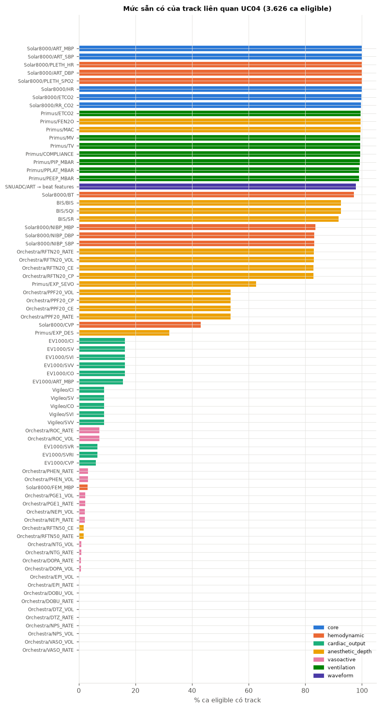
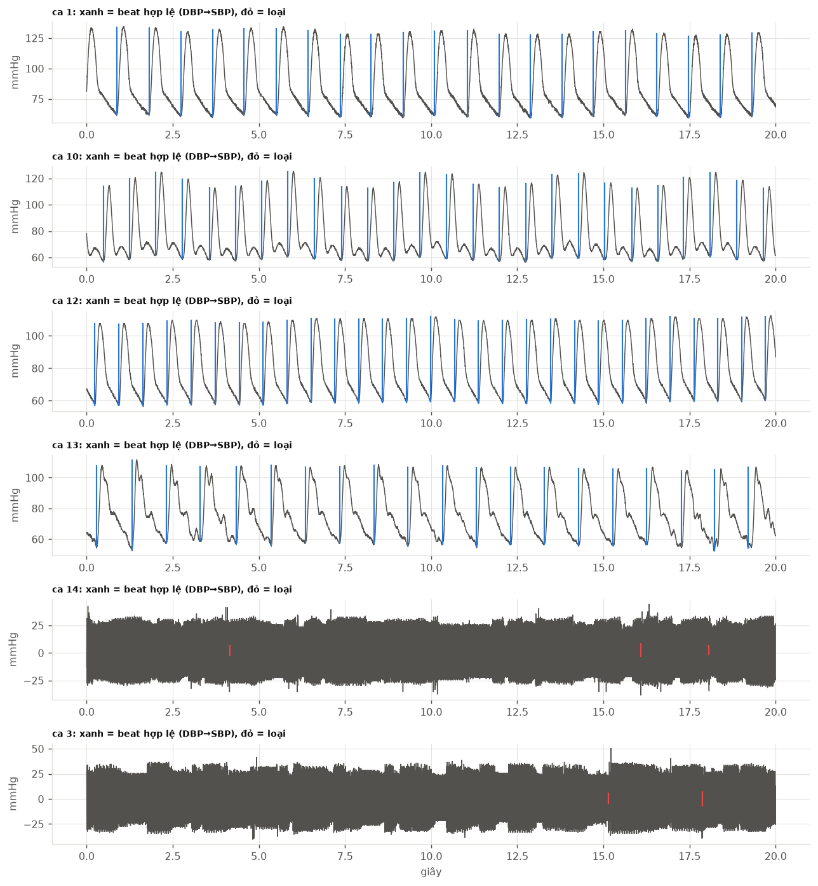
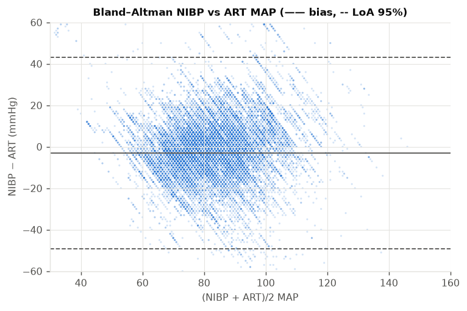
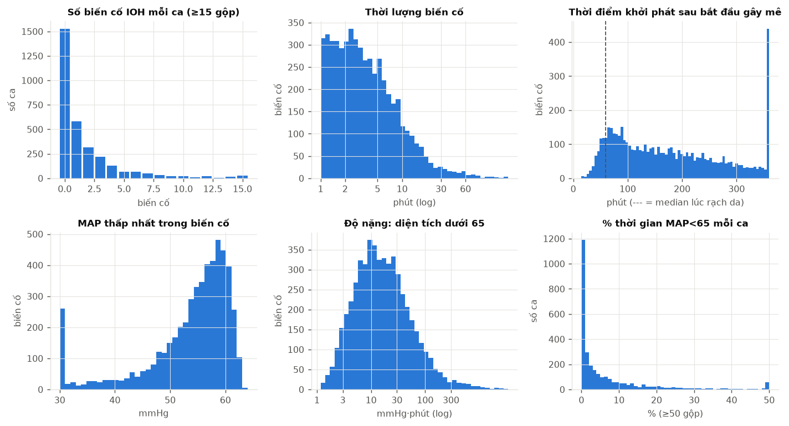
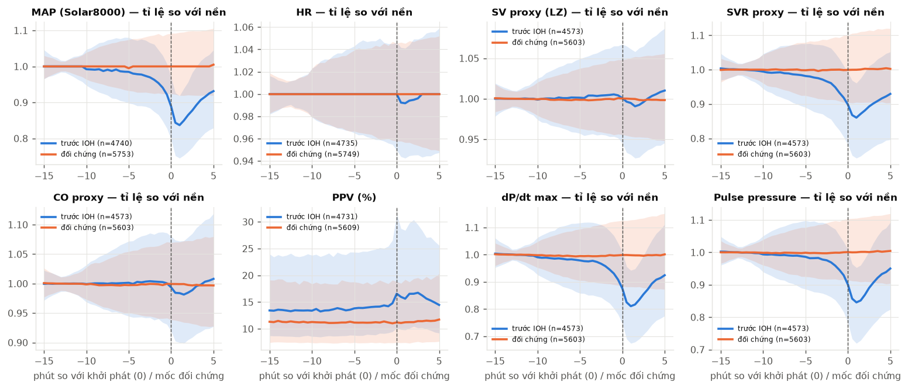
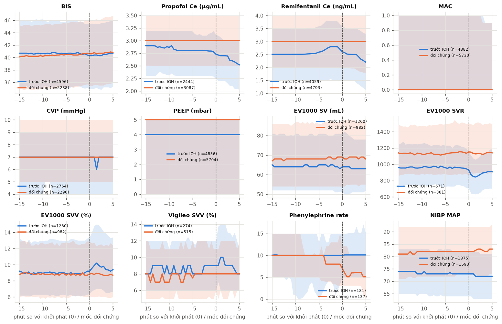
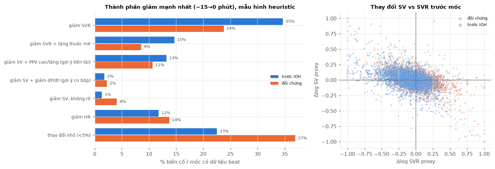
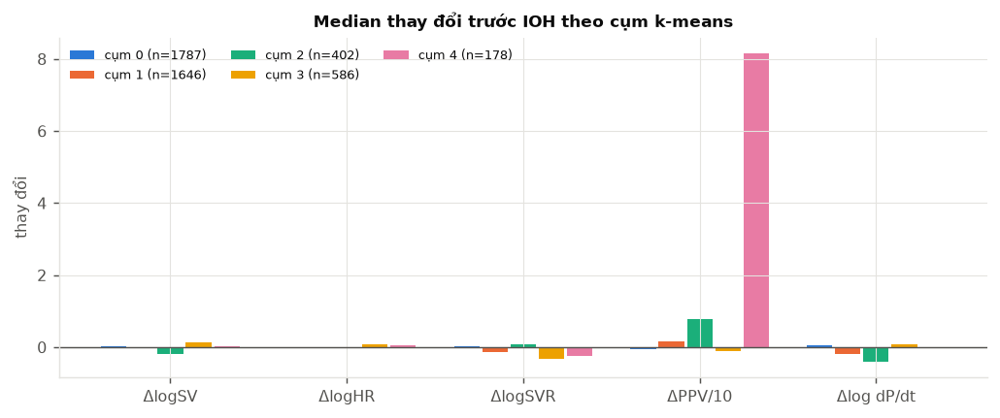
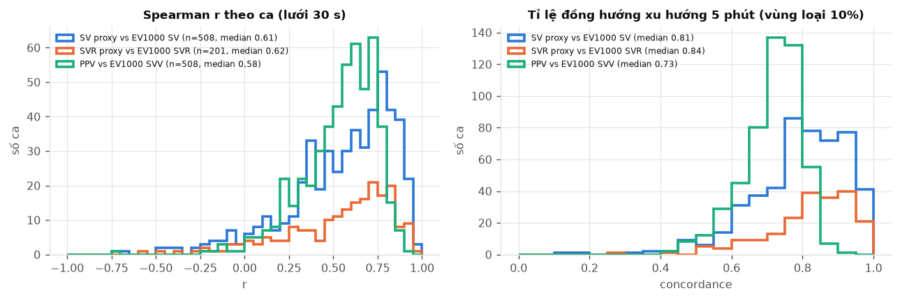
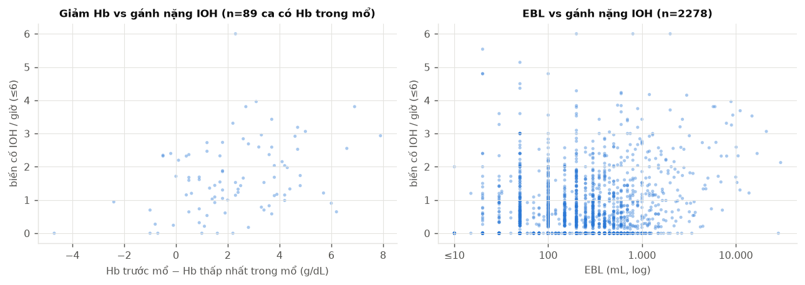

# EDA VitalDB cho UC04 — dự báo sớm tụt huyết áp và phân tách nguyên nhân

Sinh tự động bởi `scripts/eda/run_eda.py` (module `safeanes.eda`, notebook `notebooks/05_eda_vitaldb.ipynb`).
Insight về feature, nhiễu, quan hệ và feature ảnh hưởng nhất: [INSIGHTS.md](INSIGHTS.md).
Mọi con số dưới đây được tính từ dữ liệu trong `data/`; bảng đầy đủ ở các CSV cùng thư mục.

**Quy tắc phạm vi.** Mô tả cohort và mức sẵn có track dùng toàn bộ ca. Mọi phân tích chạm tới outcome
(biến cố IOH, nhãn, quỹ đạo trước biến cố, tín hiệu cơ chế) **chỉ dùng ca ngoài global test**
(`evaluation_group != unseen_test`) để không mở tập test đã khóa. IOH = MAP < 65 mmHg liên tục ≥ 60 s
theo `Protocol` (docs/PROTOCOL.md). SV/CO/SVR từ waveform là **proxy pulse-contour chưa hiệu chỉnh**
(Liljestrand–Zander), chỉ so sánh tương đối trong cùng ca; không phải đo lường hay nhãn nguyên nhân.

## Nhận xét chính

Tổng hợp từ lần chạy toàn cohort ngày 24/09/2026. Các số liệu tương ứng nằm ở các mục bên dưới và ở các CSV.

1. **Dữ liệu đủ cho nhánh nguyên nhân, nhưng không đều giữa các ca.**
   - Waveform ART trích được beat features cho 3.548/3.626 ca eligible. Tỉ lệ beat hợp lệ median là 97,6%. Có 180 ca dưới 50% beat hợp lệ; nhiều ca trong số này có kênh SNUADC/ART chỉ là nhiễu quanh 0 dù Solar8000 vẫn ghi ART_MBP.
   - BIS, MAC/khí mê và thở máy có ở trên 90% ca. Ce remifentanil có ở 83%, Ce propofol ở 54% (TIVA), CVP ở 43%.
   - CO/SV đo bằng thiết bị ít hơn nhiều: EV1000 có ở 590 ca (16%), EV1000 SVR chỉ 239 ca, Vigileo 321 ca.
   - Thuốc vận mạch truyền qua bơm Orchestra có ở dưới 4% ca. Bolus, dịch, máu và EBL chỉ có tổng cuối ca.
   - Hb trong mổ có mốc thời gian chỉ ở 97 ca thuộc phạm vi outcome. Vì vậy nhãn "mất máu" gần như không có tín hiệu theo thời gian trong VitalDB.

2. **IOH phổ biến và phần lớn ngắn.**
   - 50,9% ca có ít nhất một biến cố; tổng cộng 5.306 biến cố, tức 0,60 biến cố mỗi giờ theo dõi.
   - Thời lượng median 186 s. MAP thấp nhất median 56 mmHg.
   - Prevalence theo decision row là 3,1% ở y5 và 6,2% ở y10.
   - Khoảng 25–30% biến cố thiếu lịch sử cho y5/y10, do rơi sát đầu ca hoặc sát biến cố trước.

3. **Protocol hiện tại gần như bỏ qua tụt huyết áp sau khởi mê.**
   - Nhãn chỉ tính trong khoảng opstart→opend. Chỉ 0,6% biến cố khởi phát trong 30 phút đầu sau bắt đầu gây mê.
   - Median từ bắt đầu gây mê đến rạch da khoảng 1 giờ, trong khi giai đoạn khởi mê là nơi giãn mạch do thuốc mê thường gặp nhất.
   - Nếu UC04 muốn gợi ý "giãn mạch do thuốc mê", cần mở rộng cửa sổ nhãn về anestart. Việc này phải làm dưới dạng protocol mới có đăng ký, không sửa protocol v1.

4. **Chất lượng nhãn: 4,9% biến cố có MAP thấp nhất ≤ 30 mmHg (2,2% ≤ 20).**
   - Nhiều khả năng đây là artefact đường động mạch: flush, lấy máu, zeroing, damping. Hiện chúng được giữ vì `BOUNDS` giữ mọi giá trị thấp.
   - Cần audit bằng beat SQI trước khi dùng các biến cố này để huấn luyện nhánh nguyên nhân.

5. **Trước IOH, tín hiệu nổi bật nhất là giảm SVR proxy và giảm dP/dt; SV proxy trung vị gần như không đổi.**
   - Median thay đổi trong 15 phút trước khởi phát: ΔlogMAP −0,060; ΔlogSVR −0,067; Δlog dP/dt −0,070; ΔlogSV +0,004; ΔPPV +0,8 điểm. Nhóm đối chứng có các giá trị này ≈ 0.
   - Sự sụt diễn ra từ từ từ khoảng −10 phút rồi tăng tốc trong 2–3 phút cuối. Vì vậy lead time khả thi cho nhánh cơ chế ngắn hơn nhánh nguy cơ.
   - Theo mức giảm ≥10%:

     | Tiêu chí | Trước IOH | Đối chứng |
     |---|---|---|
     | SVR giảm | 41,7% | 23,6% |
     | dP/dt giảm | 44,4% | 27,2% |
     | PPV cuối ≥ 13% | 56,5% | 39,4% |

   - PPV **mức nền** cao hơn ở nhóm trước IOH (khoảng 13,5% so với 11%), tương tự SV/SVR EV1000 nền thấp hơn. Tức là tình trạng tiền tải/hậu tải nền là yếu tố nguy cơ, không chỉ là thay đổi cấp.

6. **Phân rã SV × HR × SVR** trên các mốc có beat, trước IOH so với đối chứng:
   - SVR chi phối: 49% so với 32%. Trong số đó có kèm tăng thuốc mê: 15% so với 9%.
   - SV giảm kèm PPV cao: 13% so với 11%.
   - SV giảm kèm dP/dt giảm: 2% so với 2%.
   - HR giảm: 12% so với 14%.
   - Thay đổi nhỏ (dưới 5%): 23% so với 37%.
   - 15% biến cố thiếu dữ liệu beat.

   **Cảnh báo:** chỉ 27% biến cố có tăng thuốc mê trong 15 phút trước, so với 24% ở đối chứng. Do đó "giãn mạch do thuốc mê" khó tách khỏi giãn mạch nói chung nếu chỉ dựa vào Ce/MAC. Mẫu hình ở đây là heuristic, không phải nhãn.

7. **Cụm k-means** (k=5, 4.599 biến cố) gần với các endotype trong y văn:
   - Cụm 0 (1.787): hầu như không đổi, khó giải thích từ proxy.
   - Cụm 1 (1.646): SVR giảm cùng dP/dt giảm.
   - Cụm 2 (402): SV giảm, PPV tăng khoảng 8 điểm, dP/dt giảm; gợi ý tiền tải.
   - Cụm 3 (586): SVR giảm mạnh, SV/HR tăng; gợi ý giãn mạch với CO cao, giống endotype "severe vasodilation with high CI" của Kouz 2023.
   - Cụm 4 (178): PPV cực lớn, là **cụm artefact**; cho thấy bắt buộc có SQI.

8. **Proxy ART bám khá tốt theo thiết bị ở mức xu hướng** (ca có EV1000, ngoài global test; median theo ca):

   | Cặp so sánh | Spearman r | Đồng hướng xu hướng 5 phút |
   |---|---|---|
   | SV proxy vs EV1000 SV (508 ca) | 0,61 | 81% |
   | SVR proxy vs EV1000 SVR (201 ca) | 0,62 | 84% |
   | PPV vs SVV | 0,58 | 73% |

   Mức này đủ để dùng Δ tương đối và dùng EV1000 làm chuẩn bạc. Chưa đủ để thay giá trị tuyệt đối.

9. **NIBP không thay thế được ART cho nhãn:**
   - bias −3,4 mmHg, LoA −49 đến +43 mmHg;
   - 55,6% thời điểm ART < 65 mmHg có NIBP ≥ 65 mmHg.

10. **Gánh nặng IOH tăng theo nguy cơ bệnh nhân:**
    - Nhóm ASA / tỉ lệ ca có IOH / biến cố mỗi giờ: ASA 1 là 39% và 0,38; ASA 3 là 63% và 0,88; ASA 4 là 86% và 1,66 (chỉ 29 ca).
    - Tuổi trên 75: 67% và 0,79.
    - Mổ cấp cứu: 0,88 so với 0,56 biến cố mỗi giờ.
    - Mất máu: Spearman ρ giữa biến cố/giờ và EBL là 0,21, RBC 0,23, giảm Hb 0,32 (97 ca). Đây là liên hệ ở mức ca, không có mốc thời gian.

11. **Tải dữ liệu:** đủ 116.123/116.124 file track UC04. Một file (Orchestra/RFTN20_CP, ca 4613; đã có RFTN20_CE) bị API trả 403, đã ghi trong `data/vitaldb_full/fetch_log.csv`.

## 1. Cohort

| bước | số ca |
|---|---|
| Tất cả ca VitalDB | 6388 |
| Loại: not_known_adult | -57 |
| Loại: not_general_anesthesia | -342 |
| Loại: insufficient_duration | -133 |
| Loại: missing_arterial_map | -2230 |
| Đủ điều kiện (eligible) | 3626 |
|   trong đó global test (khóa) | 516 |
|   phạm vi phân tích outcome | 3110 |

| index | eligible | fit/cal/val | global test | loại |
|---|---|---|---|---|
| số ca | 3626 | 3110 | 516 | 2762 |
| số bệnh nhân | 3493 | 2991 | 502 | 2679 |
| tuổi, median [IQR] | 60.0 [51.0–69.0] | 60.0 [51.0–69.0] | 61.0 [50.8–69.0] | 57.0 [46.0–66.0] |
| nữ (%) | 44.2 | 44.6 | 41.5 | 55.9 |
| BMI, median [IQR] | 22.9 [20.7–25.2] | 22.9 [20.7–25.1] | 23.2 [21.3–25.4] | 23.3 [21.1–25.7] |
| ASA ≥3 (%) | 15.5 | 16 | 12 | 7.3 |
| mổ cấp cứu (%) | 13 | 13.2 | 11.4 | 11.3 |
| THA trước mổ (%) | 33.2 | 33.3 | 32.6 | 27.5 |
| thời gian mổ (giờ), median [IQR] | 2.5 [1.6–3.8] | 2.5 [1.6–3.8] | 2.6 [1.7–3.7] | 1.1 [0.7–2.0] |
| EBL (mL), median [IQR] | 200.0 [100.0–400.0] | 200.0 [100.0–400.0] | 200.0 [100.0–400.0] | 80.0 [50.0–150.0] |

Khoa phẫu thuật (eligible):

| department | số ca | % |
|---|---|---|
| General surgery | 2291 | 63.2 |
| Thoracic surgery | 1068 | 29.5 |
| Gynecology | 184 | 5.1 |
| Urology | 83 | 2.3 |

Loại phẫu thuật (top):

| optype | số ca | % |
|---|---|---|
| Major resection | 575 | 15.9 |
| Others | 557 | 15.4 |
| Minor resection | 506 | 14 |
| Stomach | 447 | 12.3 |
| Colorectal | 401 | 11.1 |
| Biliary/Pancreas | 368 | 10.1 |
| Transplantation | 296 | 8.2 |
| Hepatic | 254 | 7 |
| Vascular | 101 | 2.8 |
| Thyroid | 100 | 2.8 |
| Breast | 21 | 0.6 |

Đường mổ / ASA:

| approach | số ca | % |
|---|---|---|
| Videoscopic | 1868 | 51.5 |
| Open | 1528 | 42.1 |
| Robotic | 230 | 6.3 |

| asa | số ca | % |
|---|---|---|
| 2 | 2202 | 60.7 |
| 1 | 777 | 21.4 |
| 3 | 516 | 14.2 |
| (thiếu) | 86 | 2.4 |
| 4 | 33 | 0.9 |
| 6 | 12 | 0.3 |

## 2. Track liên quan UC04

> **Hình 1 — Mức sẵn có của các track liên quan UC04.**
>
> **Cách đọc:** mỗi thanh là một track VitalDB. Độ dài thanh là % trong 3.626 ca eligible có track đó. Màu là nhóm sinh lý: lõi, huyết động, cung lượng tim, độ mê, vận mạch, thở máy, waveform.
>
> **Nhận xét:**
> - Tín hiệu monitor, máy thở, BIS và waveform ART có ở trên 90% ca.
> - Ce remifentanil có ở 83% ca, Ce propofol ở 54% (chỉ ca TIVA), CVP ở 43%.
> - Cung lượng tim đo bằng thiết bị hiếm: EV1000 16%, EV1000 SVR 7%, Vigileo 9%.
> - Thuốc vận mạch truyền qua bơm có ở dưới 4% ca, nên không làm input chung được; chỉ dùng làm thí nghiệm tự nhiên.

| nhóm | track | ca eligible có track | % eligible | file đã tải |
|---|---|---|---|---|
| core | Solar8000/ART_MBP | 3626 | 100 | 3626 |
| core | Solar8000/ART_SBP | 3626 | 100 | 3626 |
| core | Solar8000/ART_DBP | 3626 | 100 | 3626 |
| core | Solar8000/HR | 3626 | 100 | 3626 |
| core | Solar8000/PLETH_SPO2 | 3626 | 100 | 3626 |
| core | Solar8000/ETCO2 | 3618 | 99.8 | 3618 |
| core | Solar8000/RR_CO2 | 3612 | 99.6 | 3612 |
| hemodynamic | Solar8000/ART_MBP | 3626 | 100 | 3626 |
| hemodynamic | Solar8000/ART_SBP | 3626 | 100 | 3626 |
| hemodynamic | Solar8000/ART_DBP | 3626 | 100 | 3626 |
| hemodynamic | Solar8000/HR | 3626 | 100 | 3626 |
| hemodynamic | Solar8000/PLETH_HR | 3626 | 100 | 3626 |
| hemodynamic | Solar8000/NIBP_MBP | 3028 | 83.5 | 3028 |
| hemodynamic | Solar8000/NIBP_SBP | 3018 | 83.2 | 3018 |
| hemodynamic | Solar8000/NIBP_DBP | 3018 | 83.2 | 3018 |
| hemodynamic | Solar8000/CVP | 1563 | 43.1 | 1563 |
| hemodynamic | Solar8000/FEM_MBP | 111 | 3.1 | 111 |
| hemodynamic | Solar8000/BT | 3523 | 97.2 | 3535 |
| hemodynamic | Solar8000/PLETH_SPO2 | 3626 | 100 | 3626 |
| cardiac_output | EV1000/SV | 590 | 16.3 | 590 |
| cardiac_output | EV1000/SVI | 590 | 16.3 | 590 |
| cardiac_output | EV1000/SVV | 590 | 16.3 | 590 |
| cardiac_output | EV1000/CO | 590 | 16.3 | 590 |
| cardiac_output | EV1000/CI | 590 | 16.3 | 590 |
| cardiac_output | EV1000/SVR | 239 | 6.6 | 239 |
| cardiac_output | EV1000/SVRI | 239 | 6.6 | 239 |
| cardiac_output | EV1000/CVP | 221 | 6.1 | 221 |
| cardiac_output | EV1000/ART_MBP | 565 | 15.6 | 565 |
| cardiac_output | Vigileo/SV | 321 | 8.9 | 321 |
| cardiac_output | Vigileo/SVI | 321 | 8.9 | 321 |
| cardiac_output | Vigileo/SVV | 321 | 8.9 | 321 |
| cardiac_output | Vigileo/CO | 321 | 8.9 | 321 |
| cardiac_output | Vigileo/CI | 321 | 8.9 | 321 |
| anesthetic_depth | BIS/BIS | 3357 | 92.6 | 3357 |
| anesthetic_depth | BIS/SQI | 3357 | 92.6 | 3357 |
| anesthetic_depth | BIS/SR | 3326 | 91.7 | 3326 |
| anesthetic_depth | Primus/MAC | 3608 | 99.5 | 3608 |
| anesthetic_depth | Primus/EXP_SEVO | 2270 | 62.6 | 2270 |
| anesthetic_depth | Primus/EXP_DES | 1161 | 32 | 1161 |
| anesthetic_depth | Primus/FEN2O | 3608 | 99.5 | 3608 |
| anesthetic_depth | Orchestra/PPF20_CE | 1944 | 53.6 | 1944 |
| anesthetic_depth | Orchestra/PPF20_CP | 1944 | 53.6 | 1944 |
| anesthetic_depth | Orchestra/PPF20_RATE | 1944 | 53.6 | 1944 |
| anesthetic_depth | Orchestra/PPF20_VOL | 1944 | 53.6 | 1944 |
| anesthetic_depth | Orchestra/RFTN20_CE | 3007 | 82.9 | 3008 |
| anesthetic_depth | Orchestra/RFTN20_CP | 3007 | 82.9 | 3007 |
| anesthetic_depth | Orchestra/RFTN20_RATE | 3008 | 83 | 3008 |
| anesthetic_depth | Orchestra/RFTN20_VOL | 3008 | 83 | 3009 |
| anesthetic_depth | Orchestra/RFTN50_CE | 60 | 1.7 | 61 |
| anesthetic_depth | Orchestra/RFTN50_RATE | 60 | 1.7 | 61 |
| vasoactive | Orchestra/PHEN_RATE | 115 | 3.2 | 115 |
| vasoactive | Orchestra/PHEN_VOL | 115 | 3.2 | 115 |
| vasoactive | Orchestra/NEPI_RATE | 79 | 2.2 | 79 |
| vasoactive | Orchestra/NEPI_VOL | 79 | 2.2 | 79 |
| vasoactive | Orchestra/EPI_RATE | 6 | 0.2 | 6 |
| vasoactive | Orchestra/EPI_VOL | 6 | 0.2 | 6 |
| vasoactive | Orchestra/DOPA_RATE | 27 | 0.7 | 27 |
| vasoactive | Orchestra/DOPA_VOL | 27 | 0.7 | 27 |
| vasoactive | Orchestra/DOBU_RATE | 3 | 0.1 | 3 |
| vasoactive | Orchestra/DOBU_VOL | 3 | 0.1 | 3 |
| vasoactive | Orchestra/VASO_RATE | 1 | 0 | 1 |
| vasoactive | Orchestra/VASO_VOL | 1 | 0 | 1 |
| vasoactive | Orchestra/NTG_RATE | 31 | 0.9 | 31 |
| vasoactive | Orchestra/NTG_VOL | 31 | 0.9 | 31 |
| vasoactive | Orchestra/NPS_RATE | 1 | 0 | 1 |
| vasoactive | Orchestra/NPS_VOL | 1 | 0 | 1 |
| vasoactive | Orchestra/PGE1_RATE | 83 | 2.3 | 83 |
| vasoactive | Orchestra/PGE1_VOL | 83 | 2.3 | 83 |
| vasoactive | Orchestra/DTZ_RATE | 2 | 0.1 | 2 |
| vasoactive | Orchestra/DTZ_VOL | 2 | 0.1 | 2 |
| vasoactive | Orchestra/ROC_RATE | 266 | 7.3 | 266 |
| vasoactive | Orchestra/ROC_VOL | 266 | 7.3 | 266 |
| ventilation | Solar8000/ETCO2 | 3618 | 99.8 | 3618 |
| ventilation | Solar8000/RR_CO2 | 3612 | 99.6 | 3612 |
| ventilation | Primus/ETCO2 | 3608 | 99.5 | 3608 |
| ventilation | Primus/PEEP_MBAR | 3591 | 99 | 3591 |
| ventilation | Primus/PIP_MBAR | 3597 | 99.2 | 3597 |
| ventilation | Primus/PPLAT_MBAR | 3591 | 99 | 3591 |
| ventilation | Primus/TV | 3604 | 99.4 | 3604 |
| ventilation | Primus/MV | 3606 | 99.4 | 3606 |
| ventilation | Primus/COMPLIANCE | 3603 | 99.4 | 3603 |
| waveform | SNUADC/ART → beat features | 3548 | 97.8 | 3548 |

Waveform SNUADC/ART → beat features (`data/beats_full`): 3,548 ca có beat features; lỗi tải/xử lý 0 ca; tỉ lệ beat hợp lệ median 0.976 (ca có <50% beat hợp lệ: 180).

> **Hình 2 — Kiểm tra trực quan thuật toán phát hiện nhịp trên waveform ART.**
>
> **Cách đọc:** mỗi hàng là 20 giây waveform ART thô (đường xám) giữa ca của một ca mẫu. Mỗi vạch đứng nối DBP với SBP của một nhịp được phát hiện; xanh là nhịp hợp lệ, đỏ là nhịp bị loại.
>
> **Nhận xét:**
> - Ở các ca có đường động mạch tốt, thuật toán bắt đúng chân sóng và đỉnh của từng nhịp, kể cả khi có sóng dội.
> - Ca 3 và ca 14: kênh SNUADC chỉ là nhiễu khoảng ±30 mmHg quanh 0, trong khi monitor vẫn ghi MAP. Thuật toán loại toàn bộ các nhịp này, đúng như mong muốn.
> - Đây là lý do nhánh giải thích cần cổng chất lượng tín hiệu (SQI).

Chất lượng / chu kỳ lấy mẫu (mẫu ngẫu nhiên tối đa 80 ca mỗi track):

| track | ca mẫu | chu kỳ lấy mẫu median (s) | p1 | p50 | p99 | % giá trị ≤0 | % không hữu hạn |
|---|---|---|---|---|---|---|---|
| BIS/BIS | 80 | 1 | 0 | 39.7 | 91.7 | 8.5 | 0 |
| BIS/SQI | 80 | 1 | 0 | 92.3 | 100 | 6.7 | 0 |
| BIS/SR | 80 | 1 | 0 | 0 | 25.8 | 89.2 | 0 |
| EV1000/ART_MBP | 80 | 2 | 54 | 80 | 114 | 0 | 0 |
| EV1000/CI | 80 | 2 | 1.6 | 3.1 | 6.3 | 0 | 0 |
| EV1000/CO | 80 | 2 | 2.4 | 5.1 | 9.8 | 0 | 0 |
| EV1000/CVP | 80 | 2 | 0 | 7 | 17 | 2.8 | 0 |
| EV1000/SV | 80 | 2 | 29 | 68 | 138 | 0 | 0 |
| EV1000/SVI | 80 | 2 | 18 | 39 | 74 | 0 | 0 |
| EV1000/SVR | 80 | 2 | 372 | 1,064 | 2,615 | 0 | 0 |
| EV1000/SVRI | 80 | 2 | 740 | 1,829 | 4,118 | 0 | 0 |
| EV1000/SVV | 80 | 2 | 2.7 | 9.2 | 29.6 | 0 | 0 |
| Orchestra/DOBU_RATE | 3 | 1.01 | 0.1 | 0.1 | 20 | 0.3 | 0 |
| Orchestra/DOBU_VOL | 3 | 1.01 | 0.02 | 0.52 | 12.47 | 0.1 | 0 |
| Orchestra/DOPA_RATE | 27 | 1.01 | 0.1 | 18.1 | 80.1 | 0.7 | 0 |
| Orchestra/DOPA_VOL | 27 | 1.01 | 0.26 | 27.94 | 165.93 | 0.3 | 0 |
| Orchestra/DTZ_RATE | 2 | 1 | 0.1 | 20.1 | 20.1 | 1 | 0 |
| Orchestra/DTZ_VOL | 2 | 1 | 0 | 13.69 | 37.97 | 1.1 | 0 |
| Orchestra/EPI_RATE | 6 | 1.01 | 0.1 | 16.8 | 120 | 0.5 | 0 |
| Orchestra/EPI_VOL | 6 | 1.01 | 0 | 14.46 | 82.65 | 0.6 | 0 |
| Orchestra/NEPI_RATE | 79 | 1.01 | 0.1 | 8 | 44 | 0.8 | 0 |
| Orchestra/NEPI_VOL | 79 | 1.01 | 0.02 | 10.44 | 79.78 | 0.3 | 0 |
| Orchestra/NPS_RATE | 1 | 0.99 | 0.1 | 0.1 | 12.7 | 0.1 | 0 |
| Orchestra/NPS_VOL | 1 | 0.99 | 0 | 3.86 | 3.95 | 0.5 | 0 |
| Orchestra/NTG_RATE | 31 | 0.99 | 0.1 | 5.8 | 12.2 | 0.5 | 0 |
| Orchestra/NTG_VOL | 31 | 0.99 | 0.01 | 7.09 | 41.79 | 0.5 | 0 |
| Orchestra/PGE1_RATE | 80 | 0.99 | 0 | 20 | 26.4 | 1.7 | 0 |
| Orchestra/PGE1_VOL | 80 | 0.99 | 0.01 | 26.65 | 98.87 | 0.6 | 0 |
| Orchestra/PHEN_RATE | 80 | 0.99 | 0 | 10 | 30 | 1.6 | 0 |
| Orchestra/PHEN_VOL | 80 | 0.99 | 0.03 | 10.32 | 96.33 | 0.4 | 0 |
| Orchestra/PPF20_CE | 80 | 0.99 | 0 | 3 | 5 | 2.5 | 0 |
| Orchestra/PPF20_CP | 80 | 0.99 | 0 | 3 | 5.1 | 2.3 | 0 |
| Orchestra/PPF20_RATE | 80 | 0.99 | 0 | 16.83 | 55.86 | 13 | 0 |
| Orchestra/PPF20_VOL | 80 | 0.99 | 0 | 40.34 | 127.01 | 2.3 | 0 |
| Orchestra/RFTN20_CE | 80 | 0.99 | 0 | 3 | 8 | 2.5 | 0 |
| Orchestra/RFTN20_CP | 80 | 0.99 | 0 | 3 | 8.01 | 2.2 | 0 |
| Orchestra/RFTN20_RATE | 80 | 0.99 | 0 | 16.68 | 114.79 | 19.6 | 0 |
| Orchestra/RFTN20_VOL | 80 | 0.99 | 0 | 26.7 | 260.7 | 2.5 | 0 |
| Orchestra/RFTN50_CE | 61 | 0.99 | 0 | 4 | 10.01 | 1.4 | 0 |
| Orchestra/RFTN50_RATE | 61 | 0.99 | 0 | 11.89 | 49.74 | 14.6 | 0 |
| Orchestra/ROC_RATE | 80 | 0.99 | 0.1 | 7.1 | 15.1 | 0.4 | 0 |
| Orchestra/ROC_VOL | 80 | 0.99 | 0.05 | 17.02 | 86.11 | 0.2 | 0 |
| Orchestra/VASO_RATE | 1 | 1.01 | 0.1 | 4.1 | 12.1 | 0 | 0 |
| Orchestra/VASO_VOL | 1 | 1.01 | 0.63 | 6.29 | 9.03 | 0 | 0 |
| Primus/COMPLIANCE | 80 | 7.03 | 13.24 | 30.7 | 59.5 | 0 | 0 |
| Primus/ETCO2 | 80 | 7.02 | 0 | 35 | 48 | 2.8 | 0 |
| Primus/EXP_DES | 80 | 7 | 0 | 0 | 7.7 | 61.2 | 0 |
| Primus/EXP_SEVO | 80 | 7.02 | 0 | 1.4 | 2.8 | 35.5 | 0 |
| Primus/FEN2O | 80 | 7.01 | 0 | 0 | 0 | 100 | 0 |
| Primus/MAC | 80 | 7.01 | 0 | 0 | 1.3 | 70.7 | 0 |
| Primus/MV | 80 | 7.04 | 0.9 | 5.9 | 10.5 | 0.4 | 0 |
| Primus/PEEP_MBAR | 80 | 7.03 | 0 | 5 | 8 | 30 | 0 |
| Primus/PIP_MBAR | 80 | 7.04 | 8 | 17 | 32 | 0 | 0 |
| Primus/PPLAT_MBAR | 80 | 7.02 | 7 | 16 | 31 | 0 | 0 |
| Primus/TV | 80 | 7.02 | 83 | 419 | 632 | 0 | 0 |
| Solar8000/ART_DBP | 80 | 2 | -19 | 61 | 100 | 4.5 | 0 |
| Solar8000/ART_MBP | 80 | 2 | -25 | 80 | 185 | 5.5 | 0 |
| Solar8000/ART_SBP | 80 | 2 | -10 | 115 | 172 | 3.3 | 0 |
| Solar8000/BT | 80 | 2 | 21.5 | 35.8 | 37.1 | 0 | 0 |
| Solar8000/CVP | 80 | 2 | -59 | 6 | 252 | 16.2 | 0 |
| Solar8000/ETCO2 | 80 | 2 | 0 | 35 | 48 | 1.8 | 0 |
| Solar8000/FEM_MBP | 80 | 2 | -23 | 70 | 118 | 2.9 | 0 |
| Solar8000/HR | 80 | 2 | 44 | 71 | 118 | 0.6 | 0 |
| Solar8000/NIBP_DBP | 80 | 2 | 36 | 68 | 108 | 0 | 0 |
| Solar8000/NIBP_MBP | 80 | 2 | 49 | 82 | 139 | 0 | 0 |
| Solar8000/NIBP_SBP | 80 | 2 | 70 | 112 | 199 | 0 | 0 |
| Solar8000/PLETH_HR | 80 | 2 | 46 | 71 | 110 | 0 | 0 |
| Solar8000/PLETH_SPO2 | 80 | 2 | 92 | 100 | 100 | 0 | 0 |
| Solar8000/RR_CO2 | 80 | 2 | 6 | 15 | 22 | 0.1 | 0 |
| Vigileo/CI | 80 | 2 | 1.4 | 2.7 | 5.9 | 0 | 0 |
| Vigileo/CO | 80 | 2 | 2.1 | 4.1 | 9.2 | 0 | 0 |
| Vigileo/SV | 80 | 2 | 34 | 62 | 131 | 0 | 0 |
| Vigileo/SVI | 80 | 2 | 14 | 36 | 61 | 0 | 0 |
| Vigileo/SVV | 80 | 2 | 2 | 9 | 26 | 0 | 0 |

NIBP vs ART MAP (cặp đo NIBP với ART trong 10 s trước): cặp đo: 365209, số ca: 282, bias (NIBP−ART): -3.41, LoA thấp: -49.35, LoA cao: 42.54, % ART<65 mà NIBP≥65: 55.6.

> **Hình 3 — Đồng thuận giữa huyết áp không xâm lấn (NIBP) và huyết áp động mạch xâm lấn (ART).**
>
> **Cách đọc:** biểu đồ Bland–Altman. Mỗi điểm là một lần đo NIBP ghép với MAP động mạch trong 10 giây trước đó (365.209 cặp, 282 ca). Trục ngang là trung bình hai phép đo, trục dọc là NIBP − ART. Đường liền là độ lệch trung bình; hai đường đứt là giới hạn đồng thuận 95%.
>
> **Nhận xét:**
> - Độ lệch trung bình nhỏ (−3,4 mmHg), nhưng giới hạn đồng thuận rất rộng (−49 đến +43 mmHg).
> - Các vệt chéo xuất hiện vì NIBP giữ nguyên giá trị giữa hai lần đo trong khi ART thay đổi.
> - Ở 55,6% thời điểm ART < 65 mmHg, NIBP vẫn ≥ 65 mmHg. Vì vậy NIBP không thay ART để gán nhãn IOH được.

## 3. Biến cố IOH (ngoài global test)

| index | giá trị |
|---|---|
| số ca phân tích outcome | 3110 |
| số bệnh nhân | 2991 |
| giờ theo dõi (lưới 2 s) | 8,860.7 |
| số biến cố IOH | 5306 |
| % ca có ≥1 biến cố | 50.9 |
| biến cố / giờ | 0.6 |
| thời lượng biến cố, median [IQR] (s) | 186.0 [105.0–365.0] |
| MAP thấp nhất, median [IQR] | 56.0 [51.0–59.0] |
| AUC<65, median [IQR] (mmHg·phút) | 14.9 [6.9–34.1] |
| % biến cố trong 20 phút đầu sau rạch da | 18.1 |
| % biến cố đủ lịch sử cho y5 (eligible_300) | 69.1 |
| % biến cố đủ lịch sử cho y10 (eligible_600) | 74.8 |
| % thời gian MAP<65 (median theo ca) | 1.98 |
| y5 dương / âm / censored (decision row eligible) | 23,663 / 738,967 / 51,109 (prevalence 3.1%) |
| y10 dương / âm / censored (decision row eligible) | 44,610 / 678,281 / 90,848 (prevalence 6.2%) |

> **Hình 4 — Tổng quan các biến cố IOH trong phạm vi phát triển (3.110 ca, 5.306 biến cố).**
>
> **Cách đọc:** sáu panel mô tả phân bố:
> - số biến cố mỗi ca (≥ 15 gộp);
> - thời lượng biến cố (thang log);
> - thời điểm khởi phát tính từ lúc bắt đầu gây mê (đường đứt là median thời điểm rạch da; cột cuối gộp ≥ 6 giờ);
> - MAP thấp nhất trong biến cố (≤ 30 gộp);
> - diện tích dưới ngưỡng 65 mmHg;
> - % thời gian MAP < 65 của từng ca.
>
> **Nhận xét:**
> - Khoảng một nửa số ca không có biến cố nào; phân bố số biến cố lệch phải.
> - Đa số biến cố kéo dài 1–5 phút (median 186 s).
> - Khởi phát tập trung ngay sau rạch da; gần như không có biến cố trong 30 phút đầu vì protocol chỉ tính từ opstart.
> - MAP thấp nhất có median 56 mmHg. Cột ≤ 30 mmHg (4,9% biến cố) nhiều khả năng là artefact.
> - Median theo ca của % thời gian MAP < 65 chỉ khoảng 2%, nhưng có đuôi dài.

Độ phủ tín hiệu bổ trợ trong phạm vi outcome (số ca có ít nhất một giá trị trên lưới):

| index | số ca |
|---|---|
| ca có beats | 2901 |
| ca có bis | 2876 |
| ca có ppf_ce | 1682 |
| ca có rftn_ce | 2581 |
| ca có mac | 3095 |
| ca có cvp | 1202 |
| ca có nibp_mbp | 2178 |
| ca có ev_sv | 515 |
| ca có ev_svr | 205 |
| ca có ev_svv | 515 |
| ca có ev_co | 515 |
| ca có vg_sv | 274 |
| ca có vg_svv | 274 |
| ca có phen_rate | 92 |
| ca có nepi_rate | 67 |
| ca có peep | 3081 |

## 4. Quỹ đạo trước biến cố

Căn theo mốc khởi phát (−15 → +5 phút); đối chứng = mốc ngẫu nhiên (tối đa 2/ca) có MAP ≥ 65,
không có khởi phát trong ±15 phút. Đường = median, dải = IQR. Tín hiệu tỉ lệ được chuẩn hóa theo nền −15→−10 phút của chính ca.

> **Hình 5 — Quỹ đạo huyết áp và các đặc trưng theo nhịp trong 15 phút trước và 5 phút sau khởi phát IOH.**
>
> **Cách đọc:**
> - Xanh: median các biến cố IOH, căn theo thời điểm khởi phát (phút 0).
> - Cam: mốc đối chứng có MAP ≥ 65 mmHg và không có IOH trong ±15 phút.
> - Dải màu: khoảng tứ phân vị (IQR).
> - Các tín hiệu có nhãn "tỉ lệ so với nền" được chia cho giá trị nền (−15 đến −10 phút) của chính ca đó, nên 1,0 nghĩa là không đổi.
>
> **Nhận xét:**
> - MAP tách khỏi nhóm đối chứng từ khoảng −8 phút, giảm dần chừng 5%, rồi rơi nhanh trong 2–3 phút cuối (đáy khoảng 0,85 lần nền).
> - SVR proxy, dP/dt và áp lực mạch (PP) có cùng hình dạng (giảm 13–19% tại đáy). SV/CO proxy và HR gần như phẳng.
> - PPV của nhóm trước IOH cao hơn đối chứng suốt 15 phút (khoảng 13,5% so với 11%).
> - Chữ ký chính là giảm hậu tải. dP/dt động mạch giảm cùng SVR, nên nó phản ánh cả trương lực mạch, không chỉ sức co bóp.

> **Hình 6 — Quỹ đạo các tín hiệu ngữ cảnh (độ mê, thuốc, thở máy, thiết bị đo cung lượng tim) quanh khởi phát IOH.**
>
> **Cách đọc:** cùng cách căn thời gian và màu như hình trước, nhưng hiển thị **giá trị tuyệt đối**. Tín hiệu chỉ có ở một phần ca, nên số ca (n) trong chú giải khác nhau giữa các panel.
>
> **Nhận xét:**
> - **BIS:** không khác giữa hai nhóm.
> - **Ce propofol:** thấp hơn ở nhóm IOH và giảm tiếp sau khởi phát.
> - **Ce remifentanil:** tăng từ khoảng 2,5 lên 2,8 ng/mL trong 5 phút trước khởi phát, rồi giảm sau đó (bác sĩ hạ liều). Điều này phù hợp với giãn mạch do opioid.
> - **EV1000:** SV nền thấp hơn (khoảng 64 so với 68 mL), SVR nền thấp hơn (khoảng 960 so với 1.140) và giảm tại khởi phát; SVV tăng sau khởi phát.
> - **NIBP:** median thấp hơn (74 so với 82 mmHg).
> - **MAC, PEEP, CVP:** median không khác. Median MAC bằng 0 vì nhiều ca là TIVA.
> - **Phenylephrine:** chỉ có ở rất ít ca, không đủ để kết luận.

Median thay đổi "trễ (−2→0 phút) so với nền (−15→−10 phút)":

| index | control median | control count | event median | event count |
|---|---|---|---|---|
| dlog_map | 0 | 5,754 | -0.06 | 4,757 |
| dlog_bt_sv_lz | -0 | 5,604 | 0 | 4,605 |
| dlog_bt_hr | -0 | 5,604 | -0 | 4,605 |
| dlog_bt_svr_lz | 0 | 5,604 | -0.07 | 4,605 |
| d_bt_ppv | 0.14 | 5,604 | 0.8 | 4,599 |
| dlog_bt_dpdt | -0 | 5,604 | -0.07 | 4,605 |
| d_bis | 0.4 | 5,284 | -0.1 | 4,457 |
| d_ppf_ce | 0 | 3,070 | 0 | 2,359 |
| d_rftn_ce | 0 | 4,759 | 0 | 3,917 |
| d_mac | 0 | 5,729 | 0 | 4,737 |
| d_cvp | 0 | 2,258 | 0 | 2,681 |
| d_ev_svr | -9.5 | 379 | -22.5 | 642 |
| d_ev_svv | 0.1 | 978 | 0.2 | 1,211 |

## 5. Tín hiệu gợi ý cơ chế (mô tả, không phải nhãn)

Phân rã ΔlogMAP ≈ ΔlogSV + ΔlogHR + ΔlogSVR trên proxy beat; "thành phần chi phối" = thành phần giảm mạnh nhất.
Mẫu hình heuristic chỉ để xem trước phân bố, luật ở `safeanes.eda._pattern`.

> **Hình 7 — Phân rã thay đổi MAP trước IOH thành SV × HR × SVR (proxy từ waveform ART).**
>
> **Cách đọc:**
> - **Trái:** tỉ lệ các mẫu hình heuristic, xác định theo thành phần giảm mạnh nhất trong 15 phút trước mốc; chỉ tính các mốc có dữ liệu beat. Xanh là trước IOH, cam là đối chứng.
> - **Phải:** mỗi điểm là một mốc. Trục ngang là Δlog SVR proxy, trục dọc là Δlog SV proxy; điểm ở nửa trái là SVR giảm.
>
> **Nhận xét:**
> - "Giảm SVR" (tính cả trường hợp kèm tăng thuốc mê) chiếm 49% biến cố so với 32% đối chứng. Đây là khác biệt lớn nhất.
> - "Thay đổi nhỏ" ít hơn ở nhóm IOH (23% so với 37%).
> - "Giảm SV + PPV cao" chỉ nhỉnh hơn (13% so với 11%). Mẫu hình co bóp và nhịp chậm không khác đối chứng.
> - Ở panel phải, điểm trước IOH dồn sang trái và rải theo một đường chéo âm, tức SV và SVR proxy bù trừ nhau.
> - Mẫu hình ở đây là heuristic, không phải nhãn nguyên nhân.

| pattern | control | event | control (% có beat) | event (% có beat) |
|---|---|---|---|---|
| giảm HR | 770 | 542 | 13.7 | 11.8 |
| giảm SV + PPV cao/tăng (gợi ý tiền tải) | 598 | 609 | 10.7 | 13.2 |
| giảm SV + giảm dP/dt (gợi ý co bóp) | 126 | 83 | 2.2 | 1.8 |
| giảm SV, không rõ | 228 | 61 | 4.1 | 1.3 |
| giảm SVR | 1332 | 1597 | 23.8 | 34.7 |
| giảm SVR + tăng thuốc mê | 479 | 675 | 8.5 | 14.7 |
| thay đổi nhỏ (<5%) | 2071 | 1038 | 37 | 22.5 |
| thiếu dữ liệu beat | 160 | 701 | 2.9 | 15.2 |

Cụm k-means (k=5) trên thay đổi trước IOH:

| cluster | số biến cố | dlog_bt_sv_lz | dlog_bt_hr | dlog_bt_svr_lz | d_bt_ppv | dlog_bt_dpdt | d_ppf_ce | d_rftn_ce | d_mac |
|---|---|---|---|---|---|---|---|---|---|
| 0 | 1,787 | 0.01 | -0.01 | 0.02 | -0.66 | 0.04 | 0 | 0 | 0 |
| 1 | 1,646 | -0.01 | -0.01 | -0.13 | 1.7 | -0.2 | 0 | 0 | 0 |
| 2 | 402 | -0.19 | 0.01 | 0.08 | 7.85 | -0.41 | 0 | 0 | 0 |
| 3 | 586 | 0.13 | 0.07 | -0.33 | -1.01 | 0.08 | 0 | 0 | 0 |
| 4 | 178 | 0.03 | 0.04 | -0.24 | 81.64 | -0.03 | 0 | 0 | 0 |

> **Hình 8 — Năm cụm k-means của thay đổi huyết động trước IOH (4.599 biến cố có đủ dữ liệu beat).**
>
> **Cách đọc:** mỗi nhóm cột là một đặc trưng thay đổi (15 phút trước khởi phát). Màu là cụm; chiều cao cột là median trong cụm. ΔPPV đã chia 10 để cùng thang với các đặc trưng khác.
>
> **Nhận xét:**
>
> | Cụm | Số biến cố | Mẫu hình | Diễn giải |
> |---|---|---|---|
> | 0 | 1.787 | hầu như không đổi | proxy không giải thích được |
> | 1 | 1.646 | SVR giảm, dP/dt giảm | giãn mạch |
> | 2 | 402 | SV giảm, PPV tăng khoảng 8 điểm, dP/dt giảm | gợi ý thiếu dịch / tiền tải |
> | 3 | 586 | SVR giảm mạnh, SV và HR tăng | giãn mạch với CO cao |
> | 4 | 178 | PPV tăng rất lớn | artefact |
>
> - Cụm 3 giống endotype "giãn mạch nặng, CI cao" trong y văn (Kouz 2023).
> - Cụm 4 cho thấy cần SQI cho PPV.

### Proxy so với EV1000 (ca có EV1000, ngoài global test)

| index | count | 50% | 25% | 75% |
|---|---|---|---|---|
| caseid | 516 | 3,206 | 1,562.5 | 4,675.75 |
| n_ev_sv | 516 | 430 | 272.25 | 568.25 |
| r_bt_sv_lz_ev_sv | 508 | 0.61 | 0.39 | 0.77 |
| concord_bt_sv_lz_ev_sv | 500 | 0.81 | 0.73 | 0.89 |
| n_ev_svr | 516 | 0 | 0 | 426.75 |
| r_bt_svr_lz_ev_svr | 201 | 0.62 | 0.35 | 0.77 |
| concord_bt_svr_lz_ev_svr | 201 | 0.84 | 0.77 | 0.91 |
| n_ev_svv | 516 | 429.5 | 272.25 | 568 |
| r_bt_ppv_ev_svv | 508 | 0.58 | 0.43 | 0.7 |
| concord_bt_ppv_ev_svv | 508 | 0.73 | 0.67 | 0.77 |

> **Hình 9 — Kiểm chứng proxy từ waveform ART bằng thiết bị đo cung lượng tim EV1000 (ca ngoài global test).**
>
> **Cách đọc:**
> - **Trái:** phân bố hệ số Spearman r theo từng ca, trên lưới 30 s, giữa proxy và giá trị EV1000.
> - **Phải:** tỉ lệ đồng hướng của thay đổi 5 phút. Chỉ xét các thay đổi mà EV1000 dao động > 10% (vùng loại). Giá trị 1 nghĩa là proxy luôn đi cùng chiều với thiết bị.
>
> **Nhận xét:**
>
> | Cặp so sánh | Số ca | Median r | Median đồng hướng |
> |---|---|---|---|
> | SV proxy vs EV1000 SV | 508 | 0,61 | 81% |
> | SVR proxy vs EV1000 SVR | 201 | 0,62 | 84% |
> | PPV vs SVV | 508 | 0,58 | 73% |
>
> - Có một đuôi nhỏ các ca với r ≈ 0 hoặc âm, là ca proxy hỏng (damping, vị trí đầu dò).
> - Proxy đủ dùng cho **thay đổi tương đối**, chưa đủ để thay giá trị tuyệt đối.

### Mất máu

Spearman ρ với số biến cố/giờ: hb_drop: 0.321, intraop_ebl: 0.207, intraop_rbc: 0.234, intraop_crystalloid: 0.246, duration_h: 0.143.
Ca có Hb trong mổ: 97; EBL không có mốc thời gian (chỉ tổng cuối ca).

> **Hình 10 — Mất máu và gánh nặng IOH ở mức ca.**
>
> **Cách đọc:**
> - **Trái:** 89 ca có cả Hb trước mổ và Hb trong mổ. Trục ngang là mức giảm Hb, trục dọc là số biến cố IOH mỗi giờ (giá trị ≥ 6 gộp).
> - **Phải:** 2.278 ca có EBL. Trục ngang là EBL theo thang log.
>
> **Nhận xét:**
> - Liên quan dương nhưng yếu: Spearman ρ = 0,32 với giảm Hb, 0,21 với EBL.
> - Đám điểm rất rộng. EBL tập trung ở các giá trị làm tròn (50, 100, 200… mL).
> - EBL chỉ là tổng cuối ca, nên không dùng được cho dự báo hay gán nguyên nhân "mất máu" theo thời gian.

## 6. Phân nhóm

**age_group**

| age_group | ca | % ca có IOH | biến cố/giờ |
|---|---|---|---|
| 41–60 | 1209 | 44.3 | 0.54 |
| 61–75 | 1195 | 54.4 | 0.62 |
| 18–40 | 359 | 46.2 | 0.54 |
| >75 | 347 | 66.6 | 0.79 |

**sex**

| sex | ca | % ca có IOH | biến cố/giờ |
|---|---|---|---|
| M | 1723 | 52.4 | 0.63 |
| F | 1387 | 49 | 0.55 |

**asa**

| asa | ca | % ca có IOH | biến cố/giờ |
|---|---|---|---|
| 2 | 1,879 | 51.1 | 0.57 |
| 1 | 661 | 39 | 0.38 |
| 3 | 458 | 63.3 | 0.88 |
| 4 | 29 | 86.2 | 1.66 |

**emop**

| emop | ca | % ca có IOH | biến cố/giờ |
|---|---|---|---|
| 0 | 2,699 | 50.3 | 0.56 |
| 1 | 411 | 54.7 | 0.88 |

**preop_htn**

| preop_htn | ca | % ca có IOH | biến cố/giờ |
|---|---|---|---|
| 0 | 2,073 | 48.6 | 0.58 |
| 1 | 1,037 | 55.5 | 0.64 |

**department**

| department | ca | % ca có IOH | biến cố/giờ |
|---|---|---|---|
| General surgery | 1971 | 54.8 | 0.64 |
| Thoracic surgery | 923 | 44.2 | 0.48 |
| Gynecology | 148 | 50 | 0.67 |
| Urology | 68 | 30.9 | 0.26 |

**optype**

| optype | ca | % ca có IOH | biến cố/giờ |
|---|---|---|---|
| Others | 489 | 56.2 | 0.83 |
| Major resection | 481 | 41.4 | 0.37 |
| Minor resection | 436 | 40.8 | 0.44 |
| Stomach | 382 | 53.9 | 0.43 |
| Colorectal | 341 | 46.3 | 0.52 |
| Biliary/Pancreas | 319 | 62.4 | 0.69 |
| Transplantation | 258 | 64.7 | 0.89 |
| Hepatic | 218 | 50.5 | 0.48 |
| Vascular | 88 | 59.1 | 1.04 |
| Thyroid | 79 | 40.5 | 0.37 |

**approach**

| approach | ca | % ca có IOH | biến cố/giờ |
|---|---|---|---|
| Videoscopic | 1601 | 42.3 | 0.4 |
| Open | 1324 | 61.7 | 0.81 |
| Robotic | 185 | 48.1 | 0.38 |

## 7. Giới hạn dữ liệu cho UC04

- Bolus phenylephrine/ephedrine, dịch truyền, máu và EBL chỉ có **tổng cuối ca** (không có mốc thời gian);
  chỉ bơm tiêm điện Orchestra có timeline. Không thể dùng thời điểm can thiệp làm nhãn hoặc biến đầu vào đầy đủ.
- CO/SV/SVR đo bằng thiết bị (EV1000/Vigileo) chỉ có ở một phần nhỏ cohort và có thiên lệch chọn ca (mổ lớn).
- Proxy pulse-contour chưa hiệu chỉnh, nhạy với damping/artefact đường động mạch; cần SQI và kiểm chứng.
- Không có siêu âm tim, không có nhãn cơ chế chuyên gia.
