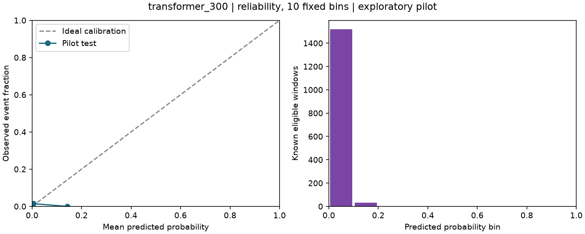
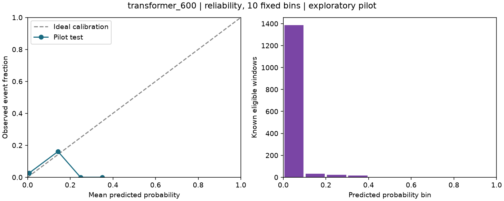
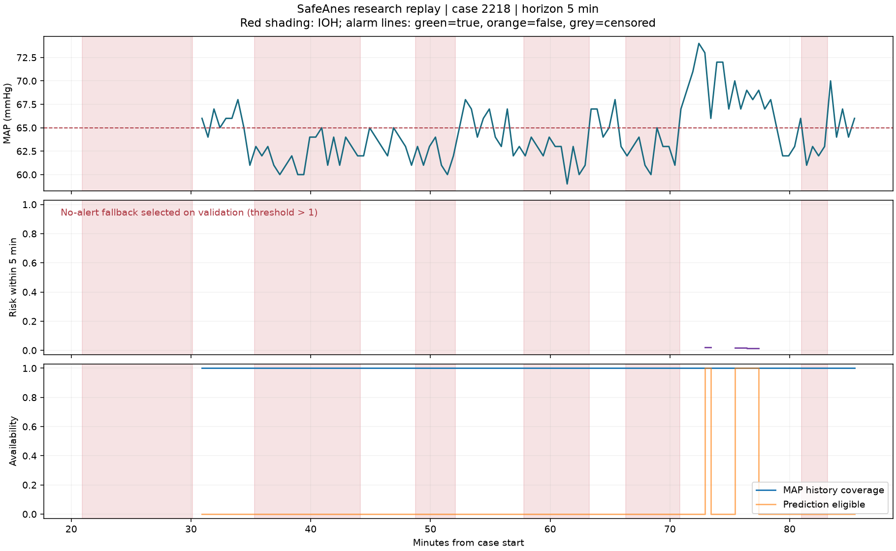
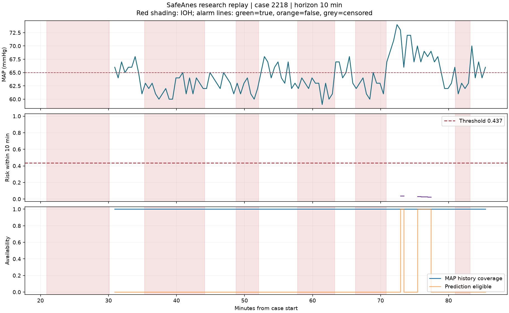

# Kết quả UC04 — thử nghiệm trên dữ liệu thật

Kết quả từ pilot nằm trong global train; chưa phải final test, kiểm định ngoài hoặc nghiệm thu lâm sàng.

- Nguồn artifacts: `artifacts/transformer_v1`.
- Dataset SHA-256: `4404bb59c4e926f7530b0731398ce1883647ed9a6e70e8d103f8ded0e8b512c7`.
- Protocol: `7b50386febe54262130beed10b12e7dded06b332ca59a06dca3e8de58bb2572a`.
- Thiết bị thực thi: `cpu`; `Intel64 Family 6 Model 141 Stepping 1, GenuineIntel`.

| Mô hình | AUROC | AP | Event recall | PPV | FA/giờ | ECE | Phát hiện/đủ điều kiện | Đạt mọi mục tiêu? |
|---|---:|---:|---:|---:|---:|---:|---:|---|
| transformer_300 | 0.941 | 0.104 | 0.000 | N/A | 0.000 | 0.012 | 0/3 | Chưa đạt |
| transformer_600 | 0.846 | 0.114 | 0.000 | N/A | 0.000 | 0.026 | 0/4 | Chưa đạt |

## Tài nguyên đã đo

- Số tham số: 120,066; số epoch: 6; checkpoint tốt nhất: epoch 1.
- Tổng thời gian các epoch: 174.9 giây.
- Peak allocated VRAM: không áp dụng (CPU).
- Thời gian inference trong JSON gồm DataLoader và sao chép dữ liệu; không phải độ trễ ứng dụng lâm sàng.

## Ngưỡng đã khóa trên validation

- `transformer_300`: threshold=1.000001; validation chọn không phát cảnh báo; độ nhạy bằng 0, chưa có mô hình cảnh báo hữu ích.
- `transformer_600`: threshold=0.437179; validation: exploratory_fallback_targets_unmet.

## Diễn giải và giới hạn

- N/A nghĩa chưa tính được metric, thường do không có cảnh báo hoặc thiếu một lớp.
- Ngưỡng được chọn trên validation. Nếu không đạt, giữ nhãn `exploratory_fallback_targets_unmet`; không nới tiêu chí.
- Khoảng tin cậy 95% bootstrap theo bệnh nhân, calibration bins/slope/intercept và phân nhóm tuổi/ASA nằm trong [diagnostics.json](diagnostics.json). Các phân nhóm nhỏ chỉ có giá trị mô tả.
- FA/giờ dùng lưới 30 giây theo protocol v1; coverage đo trên thời gian quyết định sau history. Cần audit exposure từng giây trước nghiệm thu.
- Pilot nhỏ, chưa có kiểm định ngoài hoặc nhãn nguyên nhân. Thiết bị thực tế ghi ở đầu báo cáo; không suy ra benchmark T4 từ lần chạy CPU. Các biểu đồ được chọn để audit cảnh báo/bỏ sót; bảng metric dùng toàn bộ pilot_test.
- Có thể so cùng dữ liệu/split với baseline nhưng calibrator của DL bảo toàn thứ tự hai horizon và khác sigmoid riêng từng horizon của baseline.

## Hiệu chỉnh xác suất

## Phát lại ca

